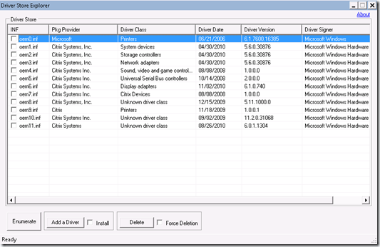

In my previous blog post [Inside the Windows 7 Driver Store](https://www.verboon.info/index.php/2010/12/inside-the-windows-7-driver-store/) I explained how to retrieve information about the Windows in-box drivers. Beside the in-box drivers the driver store also hosts the drivers installed via Windows Update or the native OEM provided driver installation package. 

  The Driver Store Explorer utility provides a GUI interface for the Windows Driver Store. So instead of using pnputil (read [Vijay’s post](http://www.msigeek.com/5569/how-to-get-an-inventory-of-all-the-installed-device-drivers-in-a-machine) for details) or dism, the Driver Store Explorer allows you to list 3rd party drivers that are already installed  within the driver store. Furthermore the tool also allows you to prestage, install or delete drivers from the driver store. The below screen shot is taken from a fresh Windows 7 installation running within a Citrix XenDesktop 5 environment. 

  

  The Driver Store Explorer can be downloaded from [here](http://driverstoreexplorer.codeplex.com/).

