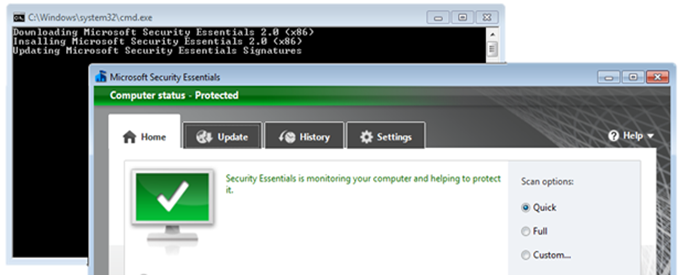

For all those that frequently setup test machines and get tired of manually installing the Microsoft Security Essentials 2.0, here’s a straight forward batch file (even a regular user could use) that does the following:

- Downloads the Microsoft Security Essential 2.0 (x86) installation source file

- Installs Microsoft Security Essentials 2.0

- Downloads and updates the virus definition signature file

[sourcecode language="plain"]
@ECHO OFF
Echo Downloading Microsoft Security Essentials 2.0 (x86)
start /wait bitsadmin /TRANSFER MSE20 http://download.microsoft.com/download/A/3/8/A38FFBF2-1122-48B4-AF60-E44F6DC28BD8/en-us/x86/mseinstall.exe %TEMP%\mseinstall.exe

Echo Insalling Microsoft Security Essentials 2.0 (x86)
start /wait %temp%\mseinstall.exe /s /runwgacheck /o

Echo Updating Microsoft Security Essentials Signatures
start /wait "" "C:\Program Files\Microsoft Security Client\msseces.exe" /update
pause
[/sourcecode]

Just copy paste the above code a batch file like getmse.cmd and launch it.

If you need the 64 bit version, simply replace the above download url with [http://download.microsoft.com/download/A/3/8/A38FFBF2-1122-48B4-AF60-E44F6DC28BD8/en-us/amd64/mseinstall.exe](http://download.microsoft.com/download/A/3/8/A38FFBF2-1122-48B4-AF60-E44F6DC28BD8/en-us/amd64/mseinstall.exe)

