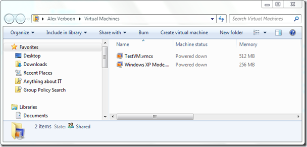
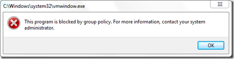
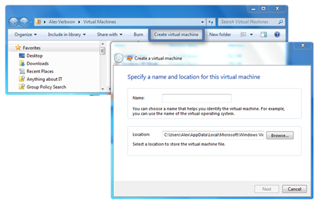
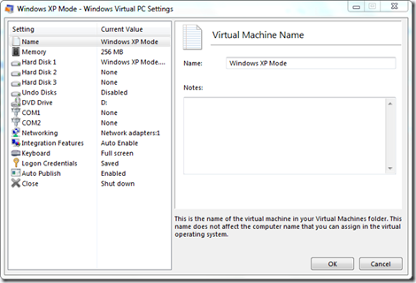

Windows Virtual PC is a great feature of Windows 7, but unfortunately Microsoft did not consider to provide any Group Policy settings to control the use of it. In an enterprise or small business environment you might want to do the following:

     
- Completely restrict the use of Windows Virtual PC (even if users have local administrative rights and can enable the feature)    
- Prevent the creation of additional Virtual machines other than the one you prepared for them such as an XPMode VM    
- Prevent users from making changes to the Virtual Machine Settings 

  Despite extensive searching I haven’t been able to find any Registry type settings related to the configuration of Windows Virtual PC, so at some stage I gave up that path and started looking at the executables that come with Windows Virtual PC. All the relevant files are stored under C:\Windows\System32.

     
- vpc.exe    
- vmwindows.exe    
- vmsal.exe    
- vpcsettings.exe    
- vpcwizard.exe 

  For a detailed description of these executables read the [Windows Virtual PC Executables](https://blogs.msdn.com/b/virtual_pc_guy/archive/2009/07/22/windows-virtual-pc-executables.aspx) post from the Virtual PC Guy’s blog. 

  Since there are no registry settings that allow us to control the use of Windows Virtual PC we have to do it with the executables, luckily Microsoft created a separate executable for the various things you can do with Windows Virtual PC. When speaking about restricting the use of executables on Windows 7 the first thing that comes to our mind is AppLocker, and that is exactly what we are going to use here. 

  [AppLocker](http://technet.microsoft.com/en-us/library/dd723678(WS.10).aspx) is a new feature introduced with Windows 7 available on Windows 7 Enterprise and ultimate. With AppLocker enterprise administrators can prevent users from installing and using unauthorized applications. To prevent users from creating or modifying Virtual machine settings, simply create an AppLocker rule for the appropriate Windows Virtual PC executable. 

  When selecting Windows Virtual PC from the Star menu **vmwindows.exe** is launched (you can see this in the shortcut properties) the Virtual Machine explorer window is launched. 

  

  To prevent users from accessing the Virtual Machine explorer window, we create a “Deny” AppLocker rule for **vmwindows.exe** Once the AppLocker rule is active, users will get the following message when trying to access Windows Virtual PC. 

  

  In the following scenario, we let users have access to the Windows Virtual PC explorer explorer window so that they can start existing Virtual Machines, but we do not want them to create new VMs.

  

  To prevent users from creating a new Virtual Machine, create a “Deny” Applocker rule for **vpcwizard.exe**. And finally if we don’t want users to modify the settings for existing VMs and assuming that they also don’t have the right to create new ones, we simply create a “Deny” Applocker rule for **vpcsettings.exe.**

  

  That’s it. Any thoughts, inputs are welcome.

