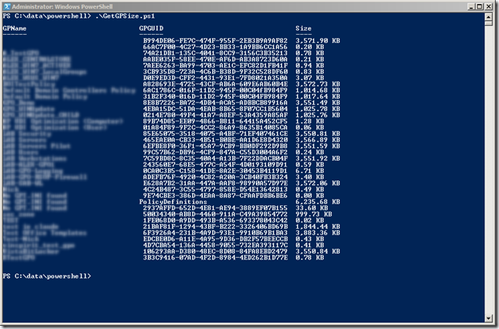

Needless to say that there are quite some benefits in using a central store for Group Policies, one of them is that you can prevent the so-called SYSVOL bloat. A good description of the SYSVOL bloat is described [here](http://blogs.technet.com/b/askds/archive/2009/12/09/windows-7-windows-server-2008-r2-and-the-group-policy-central-store.aspx). So how much size do my GPOs currently consume within the SYSVOL folder? I asked myself that question a few days ago and ended up with let’s say my first version of the **GetGPOSize** PowerShell script.

Of course you can simply open explorer and get the total size of the Policies folder, and you could also easily list the size of each folder, but since the GPO folder names are based on a GUID name, it isn't that easy to figure out what folder relates to what GPO, this is where GetGPOSize tries to help.

The below script loops through each folder retrieves the folder size and looks up the Group Policy name. As mentioned, I consider this as version 0.1 as I have a few improvements in mind such as using a command line option to specify the location and handle some exceptions. For now, all you need to do is change the following line and then run the script.

$startfolder = "**\\lab-dc01\SYSVOL\LAB.NET**\Policies\*"

Change lab-dc01\sysvol\lab.net so it matches your environment. Also make sure you leave the final * in there as it ensures that the script only loops 1 level deep.

[sourcecode language="ps"] 

# =====================================================================
#   
# Script Name : GetGPSize.ps1
#  
# Author: Alex Verboon
# Date: 24. January 2011
# Version: 0.1
#
# Purpose: Retrieve size of Group Policy folders stored in SYSVOL
#
# =====================================================================

Function Get-GPOSize() {

$startfolder = "\\lab-dc01\SYSVOL\LAB.NET\Policies\*"
$folders = get-childitem $startfolder | where{$_.PSiscontainer -eq "True"}

foreach ($fol in $Folders){
$colItems = (Get-ChildItem $fol.fullname -recurse | Measure-Object -property length -sum)
$size = "{0:N2}" -f ($colItems.sum / 1KB) + " KB"
$guid = split-path $fol.fullname -leaf

$guid1 = [System.Text.RegularExpressions.Regex]::Replace($guid,"[({})]"," ");

if (Test-Path ($fol.fullname + "\gpt.ini"))
	{
	 $Gpname = Get-GPO -Guid $guid1  | Select-Object -ExpandProperty DisplayName -ErrorAction silentlycontinue | out-string -stream

	# Get-GPO -Guid $guid1 $GPO.DisplayName
	# $($fol.fullname)
	
	}
else
	{
	$Gpname = "No GPT.INI found"
	}
	$object = New-Object -TypeName PSObject
        $object | Add-Member -MemberType NoteProperty  -Name GPName -Value $Gpname
        $object | Add-Member -MemberType NoteProperty  -Name GPGUID -Value $guid1
        $object | Add-Member -MemberType NoteProperty -Name Size -Value $size
        $object
}
}

Get-GPOSize | Sort-object -property GPName | Format-Table -Property * -autosize

[/sourcecode] 

Any comments, thoughts, inputs are welcome.

