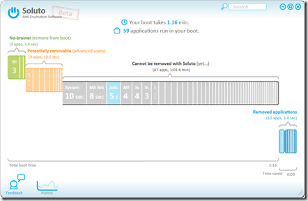

Hey here’s another cool application that can help improving Windows startup boot times. The Application is called Soluto and can be downloaded from [here](http://www.soluto.com/).

  

  Using Soluto is a no-brainer, just install it, and reboot. Soluto will show you the applications that are executed during the Windows Boot process and then allows you to either pause or delay the application during future boots.

