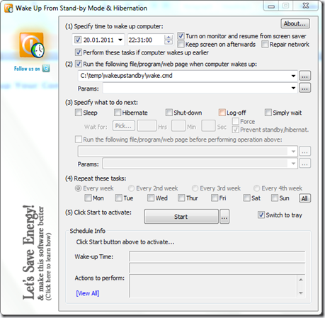
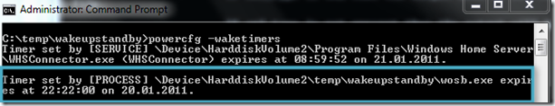
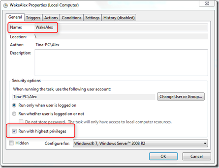
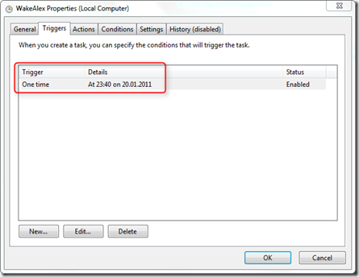
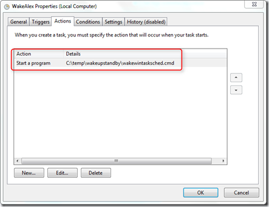
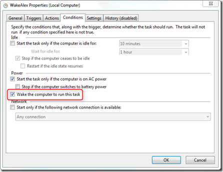

Assume you need to start a file transfer, a download or just execute a batch file once or on a regular basis in the middle of the night. What would you do? Most people will probably use some scheduling software and leave the system on until the task is scheduled to start in addition change the power settings so that the system doesn’t go into sleep or standby as this will prevent the scheduled task from running then.

  But in days where we are all cautious about power consumption leaving a system running all night doesn’t seem to be right. The FREE Utility WakeUpOnStandby (wosb.exe) solves this problem. WakeUpOnStandby allows you to schedule a task and will run it even if your system is in hibernation or standby mode and once the task is finished it can bring the system back there.

  

  WakeUpOnStandby is provided as a standalone executable (no installation needed). WOSB can be configured through the GUI and can also be used in command line mode. There is no need to learn all the commandline switches, simply use the GUI to configure what you need and export the command into the clipboard or a template batch script.

  When scheduling WOSB to repeat tasks, the Task is added to the Windows Autorun list HKCU\Software\Microsoft\Windows\CurrentVersion\Run

  To allow WOSB executing the task at the scheduled time, it is also being registered as a wake timer. Run powercfg.exe –waketimers to get a list of registered waketimers on your system.

  

  The wake.cmd script I used for testing looks as following:

  @echo off
echo i woke up >>c:\temp\wokeup.txt
powercfg.exe -lastwake >>c:\temp\wokeup.txt

  and here is the result of the above script. As you can see powercfg.exe –lastwake reports that wosb.exe brought the system back online.

  Wakeup.txt

  i woke up
Wake History Count - 1
Wake History [0]
  Wake Source Count - 1
  Wake Source [0]
    Type: Wake Timer
    **Owner: [PROCESS] \Device\HarddiskVolume2\temp\wakeupstandby\wosb.exe**

  WOSB can be downloaded from [here](http://www.dennisbabkin.com/php/download.php?what=WOSB) and very detailed documentation is provided [here](http://www.dennisbabkin.com/php/docs.php?what=WOSB).

  In case you don’t want or are not allowed to use any FREE tools such as WakeUpOnStandby, you can of course also use the Windows build in Task Scheduler for waking up the system and running a task.The below screenshots shows the configuration of a custom Task that will execute wakewintasksched.cmd even if the system is in Standby or Hibernate mode.

  

  

  

  

  **Note**! I don’t recommend creating such tasks on mobile devices as the system could be started up at an inconvenient time.

  The output looks as following:

  i woke up with Windows TaskScheduler
Wake History Count - 1
Wake History [0]
  Wake Source Count - 1
  Wake Source [0]
    Type: Wake Timer
**    Owner: [PROCESS] \Device\HarddiskVolume2\Windows\System32\svchost.exe
    Owner Supplied Reason: Task Scheduler will execute '\WakeAlex' task.**

  Sleep well and save Energy!

