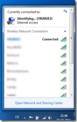
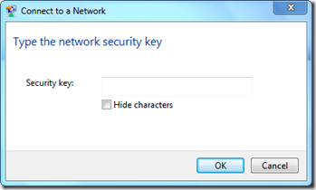

Today when I was using the netsh command to configure some firewall settings, I noticed that it also has options for WLAN. (Yes you never stop learning). When opening a command prompt and executing **NETSH Wlan Help** you get the following options. 

  add            - Adds a configuration entry to a table.     
connect        - Connects to a wireless network.      
delete         - Deletes a configuration entry from a table.      
disconnect     - Disconnects from a wireless network.      
dump           - Displays a configuration script.      
export         - Saves WLAN profiles to XML files.      
help           - Displays a list of commands.      
refresh        - Refresh hosted network settings.      
reportissues   - Generate WLAN smart trace report.      
set            - Sets configuration information.      
show           - Displays information.      
start          - Start hosted network.      
stop           - Stop hosted network.

  To see my current Wireless configuration I open a command prompt and run **NETSH Wlan Show Profile**

  Profiles on interface Wireless Network Connection:

  Group policy profiles (read only)     
---------------------------------      
    <None>

  User profiles     
-------------      
    All User Profile     : ORANJE2

  I currently have only one Wireless profile configured called ORANJE2

  Now let’s add a new Wireless Configuration, the first time I am going to do this manually so open the Wireless Connection window and select a Wireless access point. (there are a lot of them in our neighborhood and unfortunately being the unofficial first line support I know they keys of some of them)

  

  

  once connected I run the NETSH Wlan Show Profiles again

  Profiles on interface Wireless Network Connection:

  Group policy profiles (read only)     
---------------------------------      
    <None>

  User profiles     
-------------      
    All User Profile     : wakair      
    All User Profile     : ORANJE2

  To save the Wireless Profile settings open a command prompt and run NETSH Wlan Export Profile <ProfileName> 

  Interface profile "wakair" is saved in file ".\Wireless Network Connection-wakair.xml" successfully.

  Now that I have the Wireless Profile saved in an XML file I can copy it and run the below command on any other client to automatically configure the Wireless settings. 

  netsh wlan add profile filename=Wireless Network Connection-wakair.xml

  And finally to delete a Wireless Profile simply run 

  netsh wlan delete  profile <ProfileName>

