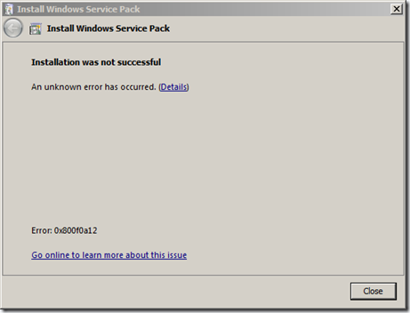
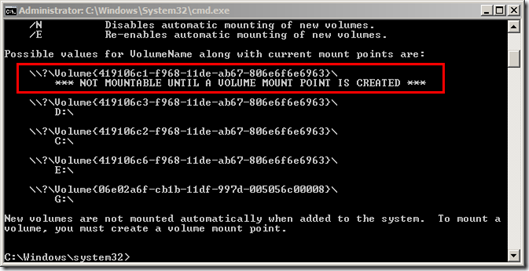
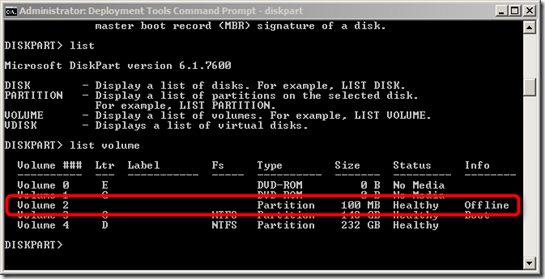
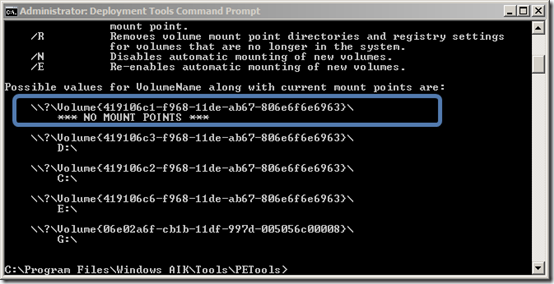
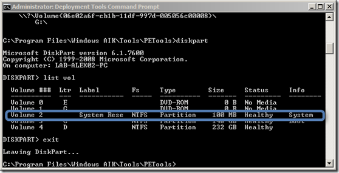
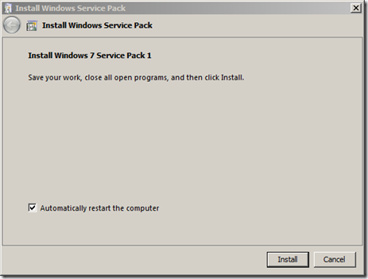

During the past days I have been manually updating a few Windows 7 clients and on two of them I received the error **0x800fa12**. 

  

  When clicking on the Go online [link](http://windows.microsoft.com/en-US/windows7/windows-7-windows-server-2008-r2-service-pack-1-sp1-installation-error-0x800F0A12) Microsoft mentions the several reasons that could lead to this error. 

     
-      The system partition isn’t automatically mounted, or made accessible to Windows, during startup. 

       
-      A hard disk containing the system partition was removed prior to beginning SP1 installation.

       
-      Windows is running on a storage area network (SAN), and access to the system partition has been disabled. 

       
-      A disk management tool from another software manufacturer was used to copy (or clone) the disk or partition on which you’re trying to install SP1

    

  Knowing my systems I could immediately exclude cause 2,3 and 4, so took a closer look at cause 1. Running the command MOUNTVOL /L showed the following result: 

  

  I than ran DISKPART and got the following result. In fact the 100MB sized System Partition was Offline. 

  

  as per Microsoft’s recommendation I then executed MOUNTVOL /E which re-enables automatic mounting of new volumes and then rebooted the system. Once rebooted I executed MOUNTVOL again and got the following result. 

  

  When executing DISKPART the results were as following: 

  

  When Launching the Service Pack 1 installer again no issues were detected and installation could continue. 

  

  Why this actually happened I don’t know. Windows 7 by default has the automount feature enabled. The current status of automount can be checked by looking at the following registry key. 

  HKEY_LOCAL_MACHINE\SYSTEM\CurrentControlSet\Services\MountMgr\NoAutoMount

  If the value is set to 1: This indicates that Automatic mounting of new volumes is Disabled. If the value is set to 0: This indicates that Automatic mounting of new volumes is Enabled.

  Additional information on this issue can be found [here](http://blogs.technet.com/b/joscon/archive/2011/02/17/windows-7-2008-r2-service-pack-1-fails-with-0x800f0a12.aspx).

