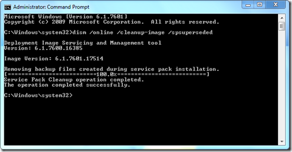

For the Windows Vista Service Packs there was [vsp1cln.exe](https://www.verboon.info/index.php/2008/11/vista-sp1-cleanup-tool-vsp1clnexe/) (SP1) and [compcln.exe](https://www.verboon.info/index.php/2009/05/windows-vista-service-pack-2-cleanup/) (SP2) to cleanup the backup files created during the Service Pack installation. For Windows 7 Microsoft did not provide a separate cleanup tool, but instead leverages the windows-build-in DISM tool.

To remove the backup files created during the Windows 7 Service Pack 1 installation run the following command from an elevated command prompt.

dism.exe /online /cleanup-image /spsuperseded

After successful completion you should get some disk space back.

