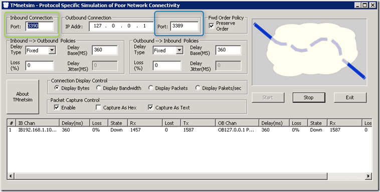
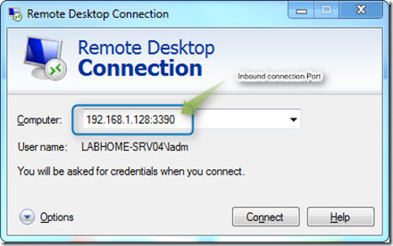

A few days ago I found another utility for testing poor network connectivity. TMNetsim is a FREE utility provided by TMUrgent Technologies. *TMnetsim* is used to simulate a wide-area network for a single protocol. TMnetsim is primarily used to simulate network delay, however, in some (rare) cases it may be used to simulate packet loss or out-of-order delivery, as well as packet capture. (For more details read the provided tmnetsim.html file).

  So to simulate an RDP connection over a network with delays simply launch the Utility on a server, configure the settings as shown below and then select the Start button.

  

  As you can see I defined Port 3390 as the Inbound Connection port for RDP, hence to connect to the simulated connection I also add that port number to the connection string.

  

  TMNetsim is available for 32 and 64 Bit versions of Windows and can be downloaded from [here](http://tmurgent.com/Tools.aspx) (look into the Other Tools section).

