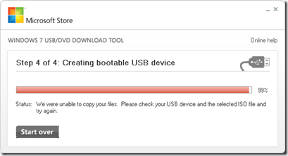
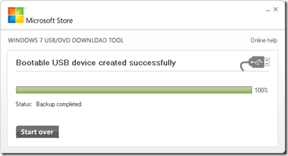

Most of you are probably familiar with the Microsoft [Windows 7 USB/DVD Download Tool](http://wudt.codeplex.com/) which allows you to create a copy of your Windows 7 ISO file on a USB or a DVD. Now the Tool works great with the original Microsoft Windows 7 ISO files, but when you want to use the tool for your own customized Windows 7 installation ISO files you might get an error as shown below. 

  

  Now luckily the tool uses a log file called events.txt

  Error during backup., Usb; Could not find file 'I:\boot\bootsect.exe'.

  So when creating your custom WinPE boot media, just make sure to copy the bootsect.exe that is located in the C:\Program Files\Windows AIK\Tools\PETools\x86 folder (or x64 if you use 64-bit PE). and copy that one into the \Boot\ folder of your Winpe sources. 

  Once you’ve done that, you should be OK to use the Windows 7 USB/DVD Download tool to copy your custom ISO file to USB or DVD. 

  

