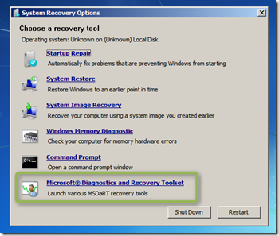
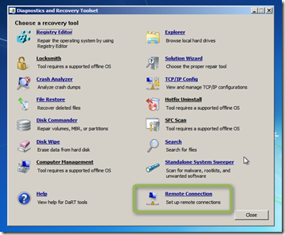
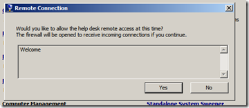
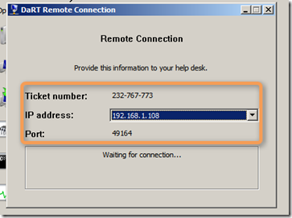
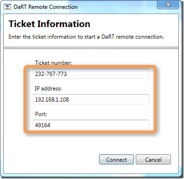
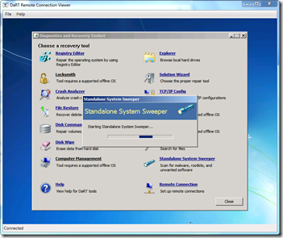

Just a few weeks ago Microsoft released a public Beta version of the Diagnostics and Recovery Toolset (DART) 7. One of the new features of DART7 is the Remote Connection Tool. Okay, I agree this is not rocked science, actually I’ve written about this before [using a VNC client](https://www.verboon.info/index.php/2009/12/remote-management-of-amtvpro-machine-with-winpe-and-vnc/comment-page-1/#comment-249), but now that it is included within the tool suite, it’s just there and ready to use. 

  Let’s have a look how this works. On the client side we boot the client into DART, this can be either from a DVD, USB, from the [local disk](https://www.verboon.info/index.php/2010/11/adding-microsoft-diagnostics-and-recovery-toolset-dart-to-your-windows-7-boot-menu/) or PXE boot. Note that when creating the DART media you must include additional network drivers for the clients you use, unless already supported by the out-of-the-box drivers included within PE. 

              1[           

](https://www.verboon.info/wp-content/uploads/2011/04/2011-04-28-21h22_21.png)        2[           

](https://www.verboon.info/wp-content/uploads/2011/04/2011-04-28-21h22_54.png)                  3         
        4         
          Once the Remote Connection tool has started, the DART Remote Connection Viewer must be launched. After entering the Ticket Number, IP Address and Port number a remote connection can be established. 

              5         
          
        6         
          According to a [blog post](http://windowsteamblog.com/windows/b/business/archive/2011/04/04/management-and-security-enhancements-for-enterprise-customers-with-dart-and-mbam.aspx) on Windows for your Business DART7 is planned to be made available in Q3 2011.

