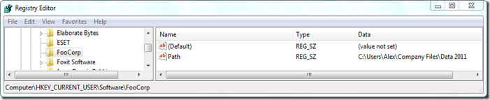

I’ve been browsing through the Microsoft TechNet Forums to see whether I can learn something new or maybe give someone a helping hand. Now before I am going to show the solution I gave someone, let me first tell you this. 

  It was just before having diner that I read the question and already thought of a possible solution, but then it was time for diner, moving away from my laptop I thought it looks like the knowledge on the good old DOS scripting language is slowly disappearing. When I came back from diner I submitted the response (after creating a little test script first). Once I had submitted my response, I noticed that the question was already marked as answered so unfortunately someone was faster in responding than me. Now comes the funny part of the story, it was the person himself who had provided the answer by writing some** C#** Code to do the job. Now this makes me feel really old 

  Ok, so much for the introduction, let’s have a look at what the was the problem to solve. The person posting the question wanted to use the REG QUERY command to retrieve a registry value that contains a path string, the problem though was that the folder path contained spaces within the folder name. 

  To demonstrate the problem I have created the following registry key, as you can see the PATH value has a folder path with spaces. 

  

  Now if we run the following command:

  reg query HKEY_CURRENT_USER\Software\FooCorp /v Path

  the result is as following. 

  

  Those that are somewhat familiar with the DOS scripting language will automatically think of using the FOR command and create a script that looks as following: 

  for /F "Tokens=3" %%a in ('reg query HKEY_CURRENT_USER\Software\FooCorp /v Path') do set xpath=%%a   
echo %xpath%

  

  The problem is, that because of the spaces within the path, not the entire path string is returned. The following code does the trick and returns the full path. 

  for /F "Tokens=3*" %%a in ('reg query HKEY_CURRENT_USER\Software\FooCorp /v Path') do set xpath=%%a %%b    
echo %xpath%

  

