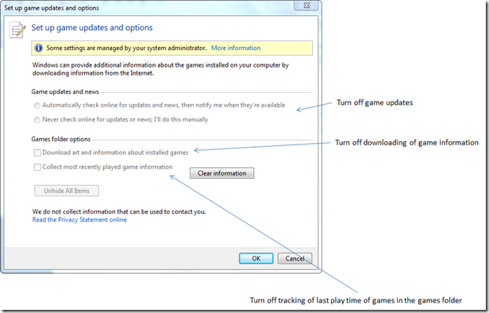

In Windows 7 Professional and Enterprise the Windows Games are not enabled by default. But if you have decided to include them in your corporate standard image or users with administrative rights enable them by themselves, you should consider using the following Group Policy settings. 

              **Location**        **Location**        **Setting**        **Description**                  Computer Configuration        Administrative Templates\Windows Components\Game Explorer        Turn off downloading of game information                 Manages download of game box art and ratings from the Windows Metadata Services.

          If you enable this setting, game information including box art and ratings will not be downloaded. 

          If you disable or do not configure this setting, game information will be downloaded from Windows Metadata Services.

                         Computer Configuration        Administrative Templates\Windows Components\Game Explorer        Turn off game updates                 Manages download of game update information from Windows Metadata Services.

          If you enable this setting, game update information will not be downloaded. 

          If you disable or do not configure this setting, game update information will be downloaded from Windows Metadata Services.

                         Computer Configuration        Administrative Templates\Windows Components\Game Explorer        Turn off tracking of last play time of games in the games folder                 Tracks the last play time of games in the Games folder.

          If you enable this setting the last played time of games will not be recorded in Games folder. This setting only affects the Games folder. 

          If you disable or do not configure this setting, the last played time will be displayed to the user.

                  

  

