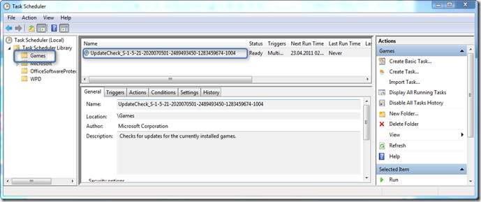
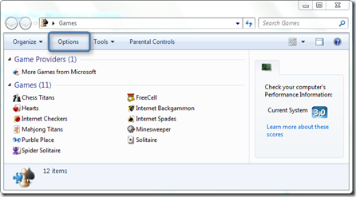
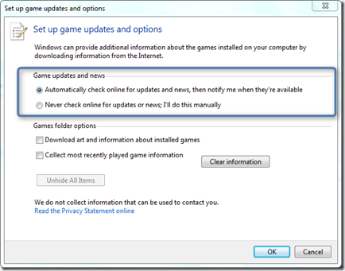
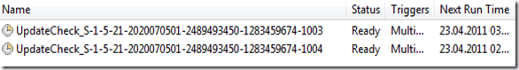

When opening the Windows Task Scheduler you might see a Task called “UpdateCheck_” located within the Games folder of the Task Scheduler Library. 

  

  To enable or disable this Task open the “Game Explorer” within Windows and then select options. 

  

  

  When selecting “Automatically check online for updates and news, then notify me when the’re available” a scheduled Task is automatically being created. When selecting “Never check online for updates or news, I’ll do it manually” the task if existed before is removed. 

  Note that this is a per user setting, so if multiple users on one system enable this setting, a separate task is created for each user. The task names contain the users SID. 

  

