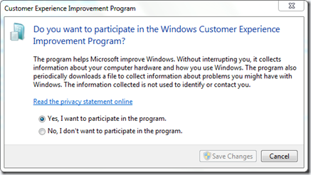
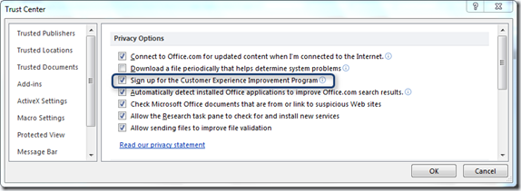
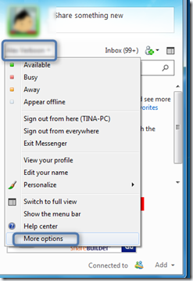
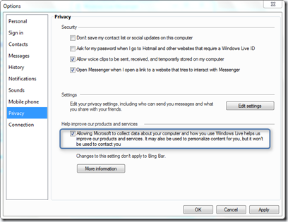
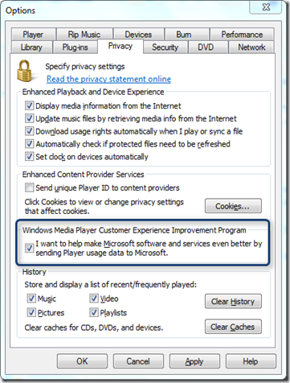
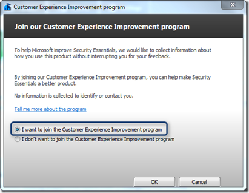

The Microsoft Customer Experience Improvement Program ([CEIP](http://www.microsoft.com/products/ceip/EN-US/default.mspx)) collects information about how people use Microsoft products. The primary objective of this program is to solve problems and improve Microsoft’s products and features. During the past two days I have tried to get a better insight into what CEIP is really about, how it works and how it can be configured. 

  
# History

  According to a blog post from Jensen Harris until the year 2003 the software design decisions at Microsoft were mostly supported by guesswork and that is not a shame because when looking around in these days, there are still many companies that make decisions based on a guess or an assumption.  The MSN product group at Microsoft were the first that used the CEIP to collect data about the performance and usage of the MSN Client. Internally at Microsoft the CEIP is called SQM. Initially SQM was an acronym for Service Quality Monitoring but was later redefined as Software Quality Metrics. While SQM already existed in many Microsoft Applications, Windows Vista was the first Operating System where SQM was shipped as an OS component. 

  
# CEIP Data Collection

  So what information is Microsoft collecting here? Well I have tried to find a detailed overview but couldn’t find one. All collected data is stored in files with an SQM file extension. The SQM file has a predefined format but it’s not publicly documented. The [CEIP Privacy statement](http://www.microsoft.com/products/ceip/en-us/privacypolicy.mspx) describes the data that is collected as following: 

     
- Configuration Data (Hardware, Operating System, Feature configuration)     
- Performance and Reliability Data (Application response times, connection speed, what caused an application to crash)     
- Program use (the things you do with an application, but not the data you process)  

  Note: CEIP does NOT collect any personal data all collected data is kept anonymous. Also once a user has enabled CEIP for a given application or operating system, there are no further interruptions. Once enabled the data is automatically collected and periodically submitted to Microsoft. I’ll speak about the process later, but let’s first have a look at the benefits of the CEIP. 

  
# Benefits of CEIP

  Now some of you might think fine, Microsoft now has a whole bunch of data now, so what? Well as mentioned before, in the early days of application and operating system development design decisions were mainly based on guessing what users might need or based on the preference of a computer nerd. With the CEIP software engineers can use real-world data (Telemetry) for making design decisions so there is a higher chance that the final product does what users expect it to do. 

  I think it’s fair to say that Windows 7 is an excellent proof of the benefits of CEIP. If you have been following the [Engineering Windows 7 blog](http://blogs.msdn.com/b/e7/) during the Windows 7 Beta phase, you might have noticed how often the Windows 7 engineering blog articles referred to real world data that was taken into consideration for developing Windows 7. Today we see the benefits, Windows 7 has been extremely well received by both consumer and enterprise users. 

  
# Configuring CEIP

  At present there is not a single location where one can enable or configure CEIP for all installed Microsoft products, so this has to be configured on a per application basis. Now let’s have a look at a system that I “assume” is what most people have out there. 

     
- Windows 7     
- Office 2010     
- Windows Live Messenger     
- Windows Media Player     
- Microsoft Security Essentials  

  Let’s start with the Windows Operating System itself. In **Windows 7** type the word “Experience” in the start menu search bar and you should find the Change Customer Experience Improvement Program Settings control panel application. 

  

  For **Microsoft Office 2010**, just open one of the Office applications such as Word. Select File, Options, Trust Center, Trust Center Settings, Privacy Options. 

  

  To configure CEIP in **Windows Live Messenger** start Live Messenger and once signed in open the menu attached to your name, then select More options. 

  

  Then select the Privacy tab.  

  

  **Windows Media Player**. Select Tools, Options, then select the Privacy tab. 

  

  To configure **Microsoft Security Essentials**, select Help, Customer Experience Improvement Program.

  

  
# At the Registry Level

  As you can imagine CEIP configuration is stored within the Windows Registry. The below table shows the individual CEIP registry keys and values for each of the above listed Applications. 

              **Application**        **Registry Key**        **Type**        **CEIP Enabled**        **CEIP Disabled**                  Windows 7                 HKEY_LOCAL_MACHINE\SOFTWARE\Microsoft\SQMClient\Windows            
CEIPEnable

               REG_DWORD        1        0                  Office 2010        HKEY_CURRENT_USER\Software\Microsoft\Office\14.0\Common\QMEnable        REG_DWORD        1        0                  Live Messenger        HKEY_CURRENT_USER\Software\Microsoft\Windows Live\Common\SQM        REG_DWORD        1        0                  Windows Media Player        HKEY_CURRENT_USER\Software\Microsoft\MediaPlayer\Preferences\          
UsageTracking           
          
HKEY_LOCAL_MACHINE\SOFTWARE\Microsoft\MediaPlayer\PREFERENCES\HME\           
<USER SID>\UsageTracking        REG_DWORD        1        0                  Microsoft Security Essentials        HKEY_CURRENT_USER\Software\Microsoft\Microsoft Security Client\SqmConsentApprove        REG_DWORD        1        0           

  
# Configuring CEIP using Group Policy

  Probably not a surprise for most of you, CEIP can also be configured through Windows Group Policy Settings. 

  
## Windows 7

              **Location**        **Location**        **Setting**        **Description**                  Computer Configuration        Administrative Templates\Windows Components\Windows Customer Experience Improvement Program        Allow Corporate redirection of Customer Experience Improvement Uploads                 If you enable this setting all Customer Experience Improvement Program uploads are redirected to Microsoft Operations Manager server.

          If you disable this setting uploads are not redirected to a Microsoft Operations Manager server.

          If you do not configure this setting uploads are not redirected to a Microsoft Operations Manager server.

                         Computer Configuration        Administrative Templates\Windows Components\Windows Customer Experience Improvement Program        Tag Windows Customer Experience Improvement data with study identifier                 This policy setting will enable tagging of Windows Customer Experience Improvement data when a study is being conducted.

          If you enable this setting then Windows CEIP data uploaded will be tagged.

          If you do not configure this setting or disable it, then CEIP data will not be tagged with the Study Identifier.            

                         Computer Configuration        Administrative Templates\System\Internet Communication Management\Internet Communication Settings        Turn off Windows Customer Experience Improvement Program                 The Windows Customer Experience Improvement Program will collect information about your hardware configuration and how you use our software and services to identify trends and usage patterns. We will not collect your name, address, or any other personally identifiable information. There are no surveys to complete, no salesperson will call, and you can continue working without interruption. It is simple and user-friendly.

          If you enable this setting, all users are opted out of Windows Customer Experience Improvement Program.

          If you disable this setting, all users are opted into Windows Customer Experience Improvement Program.

          If you do not configure this policy setting, administrator can use the Problem Reports and Solutions component in Control Panel to enable Windows Customer Experience Improvement Program for all users.

                         User Configuration        Administrative Templates\System\Internet Communication Management\Internet Communication Settings        Turn of Help Experience Improvement Program                 Specifies whether users can participate in the Help Experience Improvement program. The Help Experience Improvement program collects information about how customers use Windows Help so that Microsoft can improve it.

          If this setting is enabled, this policy prevents users from participating in the Help Experience Improvement program.

          If this setting is disabled or not configured, users will be able to turn on the Help Experience Improvement program feature from the Help and Support settings page.

                 
## Office 2010

              **Location**        **Location**        **Setting**        **Description**                  User Configuration        Administrative Templates\Microsoft Office 2010\Privacy\Trust Center        Enable customer Experience Improvement Program                 This policy setting controls whether users can participate in the Microsoft Office Customer Experience Improvement Program to help improve Microsoft Office. When users choose to participate in the Customer Experience Improvement Program (CEIP), Office 2010 applications automatically send information to Microsoft about how the applications are used. This information is combined with other CEIP data to help Microsoft solve problems and to improve the products and features customers use most often. This feature does not collect users' names, addresses, or any other identifying information except the IP address that is used to send the data. 

          If you enable this policy setting, users have the opportunity to opt into participation in the CEIP the first time they run an Office application. If your organization has policies that govern the use of external resources such as the CEIP, allowing users to opt in to the program might cause them to violate these policies. 

          If you disable this policy setting, Office 2010 users cannot participate in the Customer Experience Improvement Program. 

          If you do not configure this policy setting, the behavior is the equivalent of setting the policy to "Enabled".

                  

  
## Windows Live Messenger

              **Location**        **Location**        **Setting**        **Description**                  Computer Configuration        Administrative Templates\System\Internet Communication Management\Internet Communication Settings        Turn off Windows Customer Experience Improvement Program                 Specifies whether Windows Messenger collects anonymous information about how Windows Messenger software and service is used.

          With the Customer Experience Improvement program, users can allow Microsoft to collect anonymous information about how the product is used.  This information is used to improve the product in future releases.

          If you enable this setting, Windows Messenger will not collect usage information and the user settings to enable the collection of usage information will not be shown.

          If you disable this setting, Windows Messenger will collect anonymous usage information and the setting will not be shown.

          If you do not configure this setting, users will have the choice to opt-in and allow information to be collected.

                         User Configuration        Administrative Templates\System\Internet Communication Management\Internet Communication Settings        Turn off Windows Customer Experience Improvement Program                 Specifies whether Windows Messenger collects anonymous information about how Windows Messenger software and service is used.

          With the Customer Experience Improvement program, users can allow Microsoft to collect anonymous information about how the product is used.  This information is used to improve the product in future releases.

          If you enable this setting, Windows Messenger will not collect usage information and the user settings to enable the collection of usage information will not be shown.

          If you disable this setting, Windows Messenger will collect anonymous usage information and the setting will not be shown.

          If you do not configure this setting, users will have the choice to opt-in and allow information to be collected.

                  

  
## Windows Media Player

              **Location**        **Location**        **Setting**        **Description**                  User Configuration        Administrative Templates\Windows Components\Windows Media Player\User Interface        Hide Privacy Tab                 Hides the Privacy tab.

          This policy hides the Privacy tab in Windows Media Player. The default privacy settings are used for the options on the Privacy tab unless the user changed the settings previously.

          The Update my music files (WMA and MP3 files) by retrieving missing media information from the Internet check box is on the Privacy and Media Library tabs. When this policy is enabled, the Update my music files (WMA and MP3 files) by retrieving missing media information from the Internet check box on the Media Library tab is available, even though the Privacy tab is hidden, unless the Prevent Music File Media Information Retrieval policy is enabled.

          When this policy is not configured or disabled, the Privacy tab is not hidden, and users can configure any privacy settings not configured by other polices.

                         Computer Configuration        Administrative Templates\Windows Components\Windows Media Player        Do not show first dialog boxes                 Do Not Show First Use Dialog Boxes

          This policy prevents the Privacy Options and Installation Options dialog boxes from being displayed the first time a user starts Windows Media Player.

          This policy prevents the dialog boxes which allow users to select privacy, file types, and other desktop options from being displayed when the Player is first started. Some of the options can be configured by using other Windows Media Player group policies.

          When this policy is not configured or disabled, the dialog boxes are displayed when the user starts the Player for the first time.

                  

  
## Microsoft Security Essentials

  Microsoft Security Essentials is not designed for Enterprises, hence there is no GPO support for MSE. Of course you can use a custom ADM file as explained [here](https://www.verboon.info/index.php/2011/03/gpo-settings-for-microsoft-security-essentials/). Note that the custom ADM file described in that article does not have the CEIP option included yet. 

  When using the Microsoft Forefront Endpoint Protection client, the client is automatically configured to join the CEIP. The configuration is stored under HKLM\Software\Policies\Microsoft\Microsoft AntimalWare\Miscellaneous Configuration\SqmConsentApprove. 

   

  In [Part 2](https://www.verboon.info/index.php/2011/04/the-microsoft-customer-experience-improvement-programpart-2/) I will focus on the SQM files being generated, the data transfer process and the involvement of the Windows Task Scheduler.

