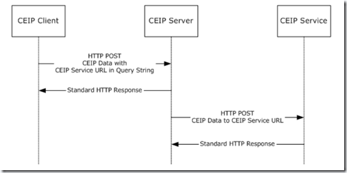
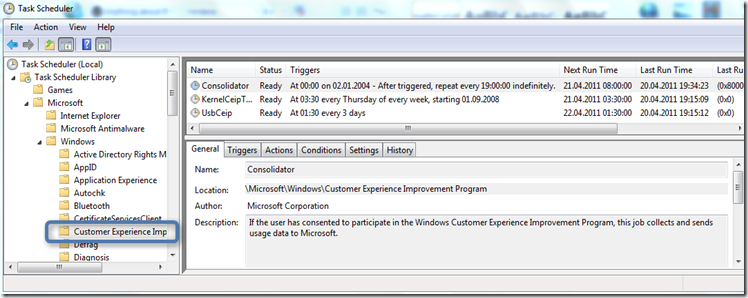
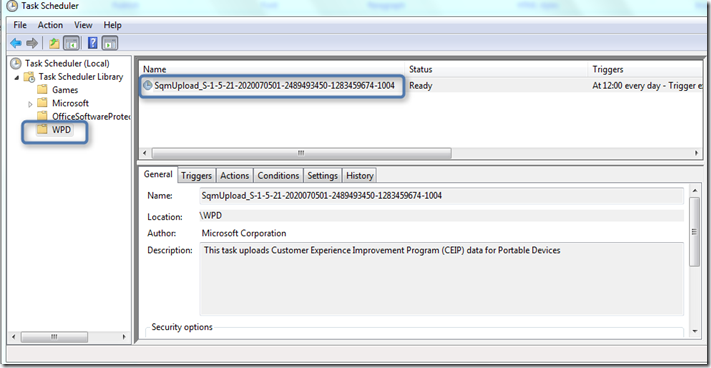
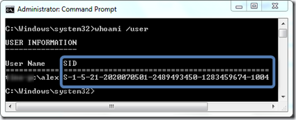

In [Part 1 I](https://www.verboon.info/index.php/2011/04/the-microsoft-customer-experience-improvement-programpart-1/) explained the history, benefits and configuration of the CEIP. In part 2 we take a closer look at the SQM data processing and the involvement of the Windows Task Scheduler. 

  
# SQM Data processing

  The following diagram was taken from the [Corporate Customer Experience Improvement Program Client-to-Server Protocol Specification](http://msdn.microsoft.com/en-us/library/dd942431(v=prot.10).aspx) document and illustrates the CEIP data flow. 

   

  

  Once CEIP is enabled simply run a dir *.sqm /s command and you will see files with an SQM extension being stored in several locations. I haven’t been able to see the files while being processed, but according to the documentation, it should all go through the following folder before it gets uploaded to Microsoft. 

  C:\ProgramData\Microsoft\Windows\Sqm\Upload

  When a user has enabled CEIP the data is periodically collected from the client and transferred to the Microsoft SQM servers. If corporate Administrators do not want their clients directly contacting the Microsoft SQM servers, the data can be [redirected via an SCOM](http://connect.microsoft.com/WindowsServer/content/content.aspx?ContentID=15698) (System Center Operations Manager) or DEM (The Desktop Error Monitoring Component included within the MDOP suite). 

  As mentioned in part 1 for privacy reasons Microsoft doesn’t share any details in public about the SQM file format. The SQM file basically contains header data and Datapoints. 

   

  
# CEIP Related Scheduled Tasks

  The below screenshot shows the scheduled tasks that manage the collection and upload of the CEIP data. Note that I have enabled the “Show Hidden Tasks” option within the View menu. The Consolidator task runs every 19 hours, the Kernel CEIP task every Thursday and the USB CEIP every 3 days. 

  Note that these tasks only collect and transfer data when a user has opted in for the Customer Experience Improvement Program. 

  

  If you have opted-in for the Windows Media Player CEIP another scheduled Task is being created. Note that a separate Task is created on a per user basis. So if multiple users opt-in for the Media Player CEIP you will see a separate task for each user. I noticed that the Task is only created at the next logon. 

  

  Note the Task name that contains the user account SID of the user that opted-in to the CEIP. 

  

  Find below a list of resources that have been helpful to me during the past days in trying to get an insight into the CEIP. 

  **Additional Information** 

  [Introduction to the Windows Server Insights Panel](http://connect.microsoft.com/WindowsServer/content/content.aspx?ContentID=15695)    
[SCOM 2007 and Server Telemetry Data](http://connect.microsoft.com/WindowsServer/content/content.aspx?ContentID=15698)    
[Windows 7: Welcome to the Windows 7 Desktop](http://channel9.msdn.com/blogs/pdc2008/pc24)    
[Inside Deep Thought (Why the UI, Part 6)](http://blogs.msdn.com/b/jensenh/archive/2006/04/05/568947.aspx)    
[Data Driven Engineering: Tracking Usage to Make Decisions](http://blogs.technet.com/b/office2010/archive/2009/11/03/data-driven-engineering-tracking-usage-to-make-decisions.aspx)    
[A conversation with Partha Sundaram about SQM](http://channel9.msdn.com/blogs/jonudell/a-conversation-with-partha-sundaram-about-sqm-software-quality-metrics)     
[Improve Debugging And Performance Tuning With ETW](http://msdn.microsoft.com/en-us/magazine/cc163437.aspx)

