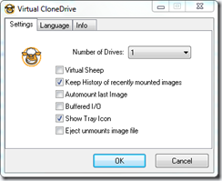
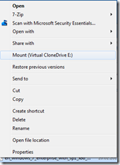

Here’s another **FREE** virtual CD/DVD clone drive utility. Virtual CloneDrive can mount and unmount most common image formats such as ISO, BIN and CCD. 

                                 

  Virtual CloneDrive can be downloaded from [here](http://www.slysoft.com/en/virtual-clonedrive.html)

