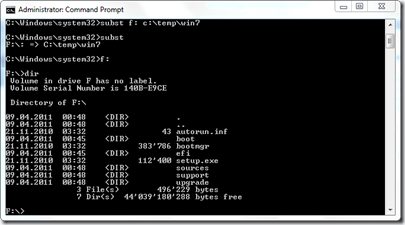
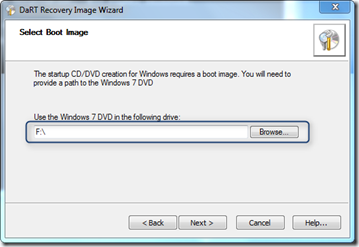

While running the BETA version of the Microsoft DaRT Recovery Image Wizard (part of the MDOP Diagnostics and Recovery Toolset) I get prompted to select the DVD Drive that holds the Windows 7 installation sources. Well unfortunately I have the ISO file available but not burned on DVD and since it’s already late I’m not really willing to find an empty DVD and burn one. Now one option is to use an ISO mounting tool like PowerISO, but while considering installing an ISO mounting utility another idea came to my mind. SUBST.

  The SUBST command allows you to create a virtual drive letter that points to a path on a physical drive. So here’s what I do to get around burning a DVD. 

  1. First I use [7-ZIP](http://www.7-zip.org/) and extract the content of en_windows_7_enterprise_with_sp1_x86_dvd_620186.iso to C:\TEMP\Win7

  2. I then run the following command in an elevated command prompt. 

  SUBST F: C:\TEMP\WIN7

  

  3. I can now select Drive F: and continue my task without burning a Windows 7 DVD (I burned so many of them but never have one available when I need one. 

  

