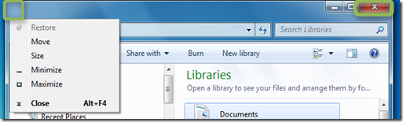
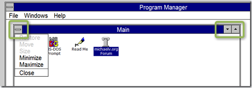
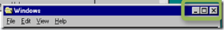

Ever wondered why a double click in the upper left corner closes the Window although there is no close icon?

  

  Well I have no proof for this, but assume that this is because in the early days of Windows, the only way to close a Window with the mouse was to DoubleClick on the Window Menu icon in the upper left corner as on the upper right side of the Window there were only buttons to minimize and maximize the Window. 

  

    It was with the release of Windows 95 when Microsoft introduced the “X” icon positioned at the upper right corner to close the Window

  

