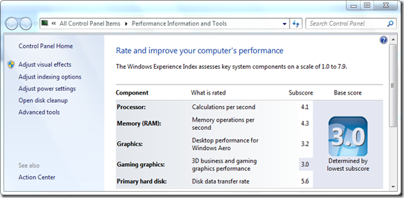
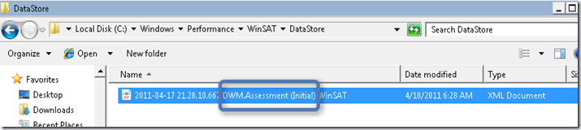
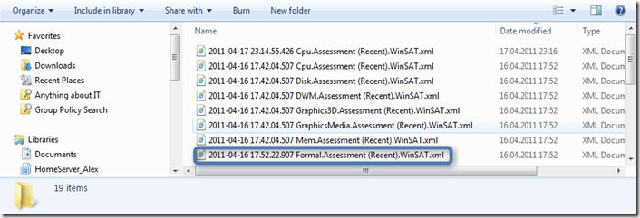
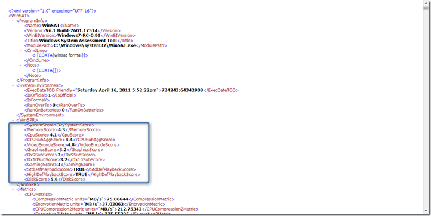
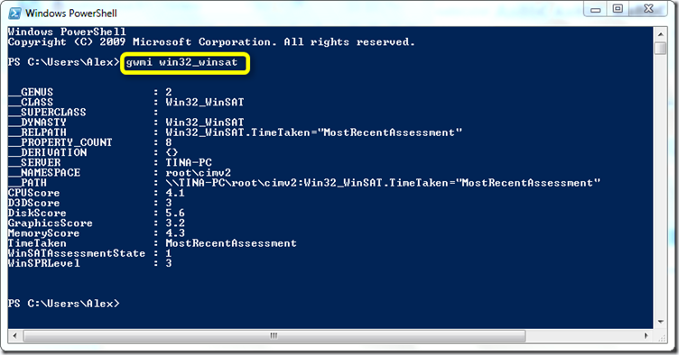
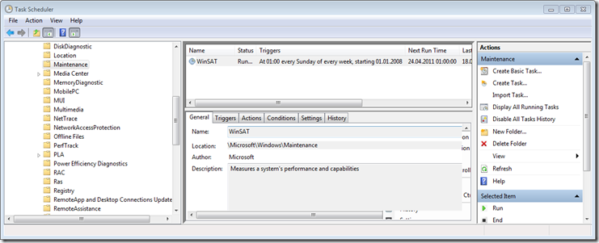

Hey there, today I am going to share some information I have gathered about the Windows System Assessment Tests aka as WinSAT. When WinSAT runs, various performance tests are executed for the following system components:

	
- CPU
	
- Memory
	
- Graphics
	
- Disk

Upon completion of the assessment tests, each component is given a score that is based on the [Windows Experience Index](http://windows.microsoft.com/en-US/windows7/What-is-the-Windows-Experience-Index). The overall score called “Base Score” is based on the lowest subscore of an individual hardware component.

So what does the Base Score mean? Well Microsoft defines it as following:

	
- *A computer with a base score of 2.0 usually has sufficient performance to do general computing tasks, such as run business programs and search the Internet. However, a computer with this base score is generally not powerful enough to run Aero, or the advanced multimedia experiences that are available with Windows 7.*
	
- *A computer with a base score of 3.0 can run Aero and many features of Windows 7 at a basic level. Some of the Windows 7 advanced features might not have all of their functionality available. For example, a computer with a base score of 3.0 can display the Windows 7 theme at a resolution of 1280 × 1024, but might struggle to run the theme on multiple monitors. Or, it can play digital TV content but might struggle to play high-definition television (HDTV) content.*
	
- *A computer with a base score of 4.0 or 5.0 can run new features of Windows 7, and it can support running multiple programs at the same time.*
	
- *A computer with a base score of 6.0 or 7.0 has a faster hard disk, and can support high-end, graphics-intensive experiences, such as multiplayer and 3‑D gaming and recording and playback of HDTV content.*

# Using the WinSAT command

The WinSAT command line tool which is included with Windows 7 (… and Vista) can be used for various purposes.

	
- Run a full system assessment
	
- Run an assessment for a certain system component
	
- Run a specific sub assessment for a certain system component
	
- Prepopulate assessment results (useful for OEMs)
	
- Export log WinSAT log files
	
- Query the WinSAT Datastore

To run a full assessment open a command prompt with administrative rights and run the following command:
winsat formal
The CPU assessment can be triggered by running the following command:
winsat cpuformal
To obtain a detailed overview of the performance data run
winsat query
Run winsat.exe /? to get a detailed syntax overview.

# Finding WinSAT Data

The WinSAT log file and test files are stored under the folder C:\Windows\Performance\WinSAT and the detailed assessment results are stored under C:\Windows\Performance\WinSAT\**DataStore**
Remember the lengthy setup times with Windows Vista? Well one of the reasons for that was because Windows Vista did perform a full assessment during setup, this has changed with Windows 7 where only the DWM (Desktop Window Manager) assessment is mandatory and is executed during Windows setup unless already prepopulated by the OEM. Running this test is mandatory so that Windows can recognize wither the system is capable of running Aero.

Once a full assessment has ran, the DataStore folder looks about this.

As you can see a separate XML file is created for the various assessment type, but all the results are stored in the file(s) that have the word “Formal.Assessment” in its filename. If you have ran WinSAT several times you will find one file with the word “Initial” and the last with the word “Recent”.

When opening the Performance Information and Tools Control Panel, the presented data is taken from the “Formal.Assessment” file(s) so when you delete these files, no rating data is displayed. As long as the not all assessment tasks have been executed the system is considered as unrated. A full assessment occurs once the system is in [idle state](http://msdn.microsoft.com/en-us/library/aa383561%28v=VS.85%29.aspx) (See scheduled Task below).
Now that’s not all, Windows also stores the WinSAT data in a WMI class called Win32_WinSAT. To access the data, open a PowerShell prompt and enter the following command:
gwmi win32_winsat

Note the WinSATAssessmentState value. A detailed description of the possible values can be found [here](http://msdn.microsoft.com/en-us/library/aa969205(v=vs.85).aspx)

# Collecting WinSAT Data

For those that use a 3rd party tool that can collect information from the Windows Registry, here’s a small script I wrote that stores the WinSAT results into a custom registry location.
`[sourcecode language="vb"]</code>

strComputer = "."
set wshshell = createobject("wscript.shell")
Set objWMIService = GetObject("winmgmts:\\" & strComputer & "\root\CIMV2")
Set colItems = objWMIService.ExecQuery("Select * from win32_winsat")

For Each objItem in colItems
wshshell.RegWrite "HKLM\SOFTWARE\FooCorp\SystemRating\BaseScore",objItem.WinSPRLevel,"REG_SZ"
wshshell.RegWrite "HKLM\SOFTWARE\FooCorp\SystemRating\Processor",objItem.CPUScore,"REG_SZ"
wshshell.RegWrite "HKLM\SOFTWARE\FooCorp\SystemRating\Memory",objItem.MemoryScore,"REG_SZ"
wshshell.RegWrite "HKLM\SOFTWARE\FooCorp\SystemRating\Graphics",objItem.GraphicsScore,"REG_SZ"
wshshell.RegWrite "HKLM\SOFTWARE\FooCorp\SystemRating\GamingGraphics",objItem.D3DScore,"REG_SZ"
wshshell.RegWrite "HKLM\SOFTWARE\FooCorp\SystemRating\PrimaryHarddisk",objItem.DiskScore,"REG_SZ"
Next

<code>[/sourcecode]

`

# WinSAT Scheduled Task

Windows 7 by default also has a scheduled Task that runs WinSAT on a weekly basis. The reason why this runs on a weekly basis is to adjust any ratings in case of system configuration changes.

**Additional Information**
[Configure Windows System Assessment Tests Scores](http://technet.microsoft.com/en-us/library/dd744241(WS.10).aspx)
[Engineering the Windows 7 “Windows Experience Index”](http://blogs.msdn.com/b/e7/archive/2009/01/19/engineering-the-windows-7-windows-experience-index.aspx)
[Win32_WinSAT Class](http://msdn.microsoft.com/en-us/library/aa969204(v=vs.85).aspx)
[What is the Windows Experience Index?](http://windows.microsoft.com/en-US/windows7/What-is-the-Windows-Experience-Index)

