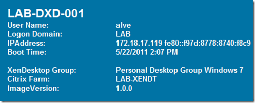
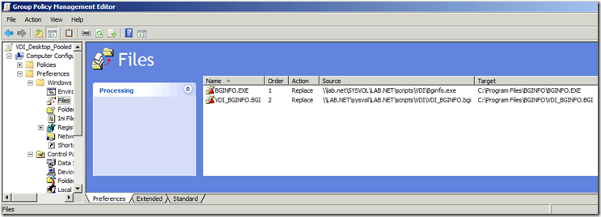
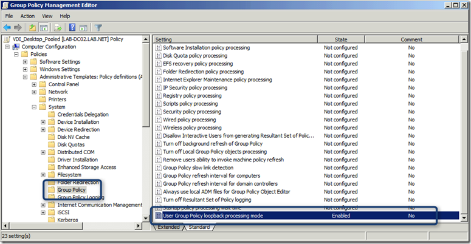
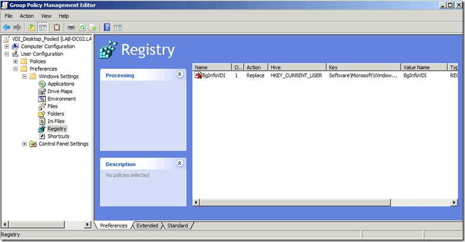

During the past weeks I have spend a bit of time with Citrix XenDesktop 5 and while I was busy creating Desktop Groups, updating Master images, I thought i t could be helpful to see some information directly on the desktop. Show things on the desktop?, okay that’s a no-brainer, [BGInfo](http://technet.microsoft.com/en-us/sysinternals/bb897557) from Sysinternals is what we need. 

  So I created a template for BGInfo that just shows the information I need when using XenDesktop. 

     
- The user that’s logged on    
- The domain the user is logged on    
- The IP Address    
- The Boot Time of the system    
- The XenDesktop group the VM belongs to    
- The Citrix Farm name    
- The version of the master image 

  

  To avoid any (none) IP Address entries, I used the trick as explained by John Baker [here](http://blogs.technet.com/b/johnbaker/archive/2011/05/04/how-to-remove-none-entries-from-bginfo.aspx) To obtain information about the XenDesktop Group and Citrix Farm I let BGInfo query the following registry keys:

     
- HKEY_LOCAL_MACHINE\SOFTWARE\Citrix\VirtualDesktopAgent\State\DesktopGroupName    
- HKEY_LOCAL_MACHINE\SOFTWARE\Citrix\VirtualDesktopAgent\State\FarmName 

  and for the Image version, I query a custom registry key I have stored in the master image to define the image version. 

     
- HKEY_LOCAL_MACHINE\SOFTWARE\FooCorp\ImageVersion 

  The BGInfo template can be downloaded from [here](https://www.verboon.info/fun/vdi_bginfo.zip)

  Deployment of the BGInfo utility and the automatic startup can be configured through  Group Policy. For my environment where I already have a GPO called VDI_Desktop_Pooled and VDI_Desktop_Personal I added the following configuration. 

  Under Computer Configuration, Preferences I have configured a GP Preference to copy bginfo.exe and the bginfo template to the c:\program files\bginfo folder. 

  

  Then under Computer Configuration, Policies, Administrative Templates, System, Group Policy I have enabled Group Policy loopback processing mode, this to ensure that the next Preferences setting that I have configured under User Configuration applies correctly. 

  

  Under User Configuration, Preferences, Windows Settings, Registry I added the following configuration: 

  

              Hive        HKEY_CURRENT_USER                  Key Path        Software\Microsoft\Windows\CurrentVersion\Run                  Value Name        BGINFOVDI                  Value Type        REG_SZ                  Value Data        "C:\Program Files\BGINFO\BGINFO.EXE" "C:\Program Files\BGINFO\VDI_BGINFO.bgi" /timer:0 /silent /nolicprompt          That’s it, Enjoy

