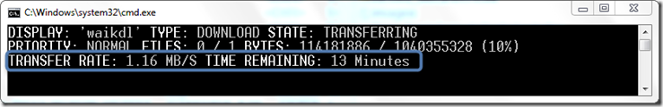
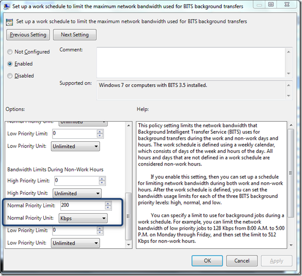
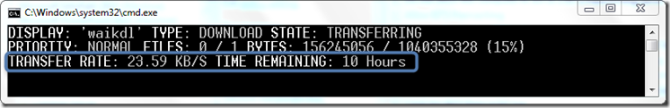
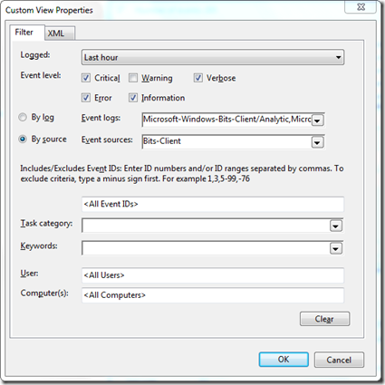

I just read the article [BITS – More Flexible Bandwidth Limit Policies](http://blogs.msdn.com/b/wmi/archive/2011/02/02/bits-more-flexible-bandwidth-limit-policies.aspx) on the Windows Management Infrastructure Blog which describes how BITS bandwidth usage can be configured through Group Policy settings. For Windows 7 (or computers with BITS 3.5 installed) there are 2 Group Policies that provide more granular control of BITS bandwidth usage during working / non-working days/hours and during scheduled maintenance days/hours.

  The 2 GPOs can be found under Computer Configuration -> Administrative Templates -> Network -> Background Intelligent Transfer Service

     
- Set up a maintenance schedule to limit the maximum network bandwidth used for BITS background transfers    
- Set up a work schedule to limit the maximum network bandwidth used for BITS background transfers 

  Now let’s have a look how that works. The [sample script](https://www.verboon.info/index.php/2008/08/using-bits-for-file-downloads/) starting a BITS transfer looks as following:

  bitsadmin /TRANSFER waikdl http://download.microsoft.com/download/8/6/d/86d6ba9c-98ff-444e-87ed-3e76772eb2a6/vista_6000.16386.061101-2205-LRMAIK_EN.img C:\temp\waik.img    

  With no GPO configured the tasks starts with 1.16 MB/S and an estimated duration of 13 minutes. 

  

  

  After having applied the GPO setting, we can clearly see that the transfer rate has dropped.

  

  Setting up a custom Event Log view with the following properties allows you see what’s happening when the GPO is being applied. 

  

