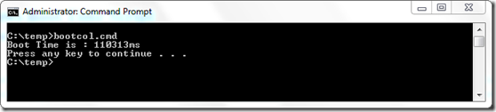

Here’s a small batch script to get the Windows 7 Boot time shown in milliseconds.

  @echo off   
FOR /F "Tokens=4" %%a IN ('%windir%\system32\wevtutil.exe qe Microsoft-Windows-Diagnostics-Performance/Operational /rd:true /f:Text /c:1 /q:"*[System[(EventID = 100)]]"  /e:Events ^| FIND "Duration"') DO SET BTIME=%%a     
ECHO Boot Time is : %BTIME%

  

  Inspiration for this script came from the article [Monitor System Startup Performance in Windows 7](http://www.windowsitpro.com/article/windows-client/monitor-system-startup-performance-in-windows-7) written by Sean Wheeler for [WindowsITPro](http://www.windowsitpro.com/).

