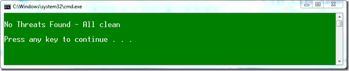
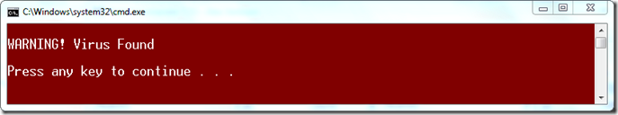

Here’s a small script I just wrote to perform an antivirus scan against a specified file. 

  @Echo off

  FOR /F "Tokens=4" %%a IN ('"C:\Program Files\Microsoft Security Client\AntiMalWare\mpcmdrun.exe" -Scan -ScanType 3 -File C:\TEMP\test1.wim -DisableRemediation') DO SET THREAT=%%a   
Echo.    
if "%THREAT%"=="no" (    
    color 2F    
    Echo No Threats Found - All clean    
    ) ELSE (    
    color 4F    
    Echo WARNING! Virus Found    
)    
Echo.    
pause

  If all is OK you get the following result

  

  If a virus was found you get the following result. 

  

  I used a test virus file which can be found [here](http://eicar.org/anti_virus_test_file.htm)

