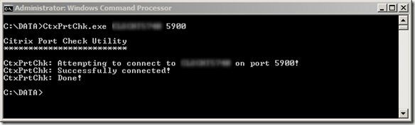

Here’s a nice small and FREE utility from Citrix that allows you to test connectivity to a remote host on a specified port. In the example below I test if port 5900 (used for VNC) is open and listening.

  

  Download CtxPrtChk from [here](http://support.citrix.com/article/CTX122450)

