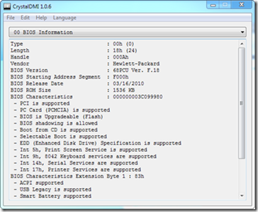

The CrystalDMI utility allows you to read DMI (Desktop Management Interface) data. CrystalDMI is FREE and does not require installation. Download is available [here](http://crystalmark.info/software/CrystalDMI/index-e.html)

  

  More information about DMI can be found [here](http://www.dmtf.org/standards/smbios)

