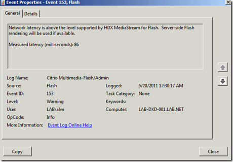
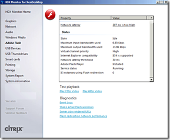
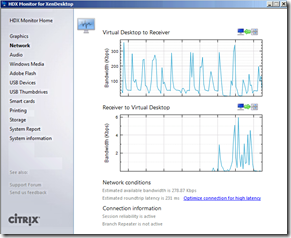
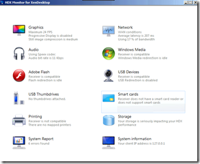

If you experience poor performance using a XenDesktop session, video and audio is not playing nicely, the Windows Event log is showing messages as shown below, it’s time to take a closer look at what’s going on. 

  *Network latency is above the level supported by HDX MediaStream for Flash.  Server-side Flash rendering will be used if available.*

  *Measured latency (milliseconds): 86*

  

  Citrix has a FREE tool available to validate the operation of HDX. The Tool is called HDX Monitor for XenDesktop and can be downloaded from [here](http://hdx.citrix.com/hdx-monitor)

                                        *The HDX Monitor is a tool to validate the operation of XenDesktop's HDX stack including the latest HDX MediaStream for Flash and HDX RealTime features. Install this tool on your virtual desktop to obtain helpful technical details about your HDX experience. The tool is organized into sections that cover the various HDX technologies. Use it to view bandwidth usage, session settings and performance metrics.*

