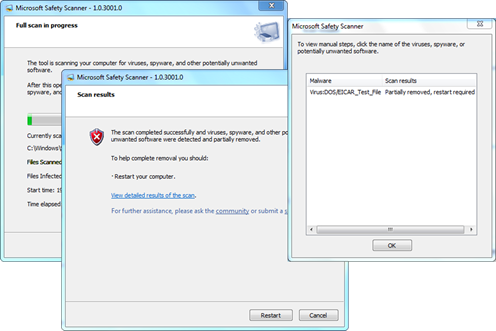
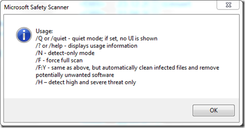

If you’re looking for a FREE Virus and Malware scanning tool that does not require installation, have a look at the Microsoft Safety Scanner tool. The software runs on Windows 7, Windows Server 2003, Windows Vista and Windows XP. I wonder why Server 2008 and 2008-R2 are not listed, but the fact that it does support Server 2003 makes it a perfect utility for my Windows Home Server. 

  

  Note that the Microsoft Safety Scanner does not provide Real Time protection, so consider this tool for scan and remove purposes when other software fails to remove a threat. Also note that the executable is about 70 MB and is only valid for 10 days, after that you must download the software again, witch contains the latest signature files. 

   Note that you can also run the Microsoft Safety Scanner interactively using one of the following command line switches:

  

  The Microsoft Safety Scanner can be downloaded from [here](http://www.microsoft.com/security/scanner/en-us/SysReq.aspx)

