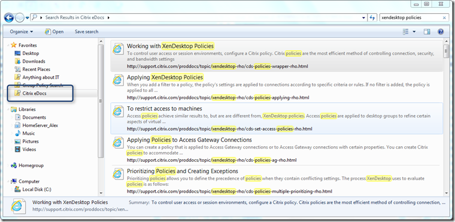
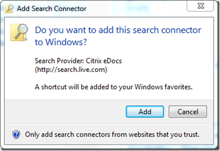

Here’s another Search Connector for Windows 7 I’ve just created. Start your [Citrix eDocs](http://support.citrix.com/proddocs/index.jsp) search directly from the Windows Explorer. 

  

  Installing the Search Connector for Citrix eDocs

     
- Download the citrixedocs.zip from [here](https://www.verboon.info/fun/citrixedocs.zip).     
- Extract the citrixedocs.osdx from the ZIP file    
- Double click on the osdx file     
    
- Click Add to install the Search Connector 

  To remove the Search Connector simply click on the Citrix eDocs Search Connector in Windows Explorer and select Remove. Then open windows explorer and navigate to C:\Users\<user>\Searches (where <user> is your username) and delete the file Citrix eDocs.searchConnector-ms

  Happy searching!

