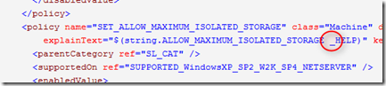
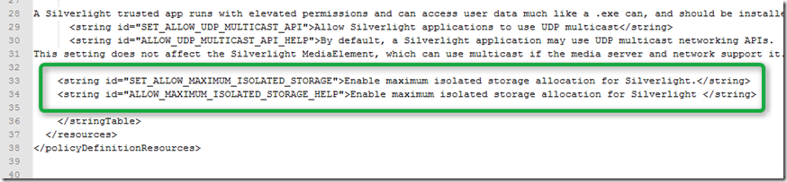
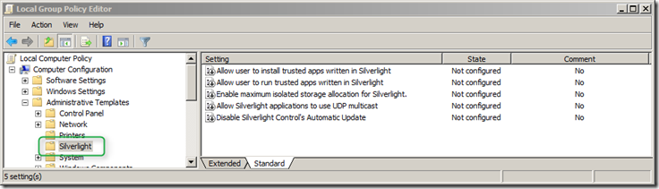
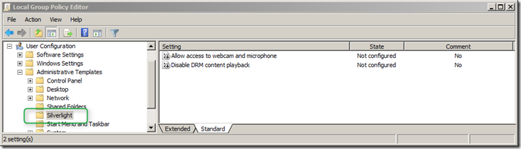

On the Microsoft Silverlight website you will find a page that describes the [available Group Policy Settings for Silverlight](http://www.microsoft.com/getsilverlight/resources/documentation/grouppolicysettings.aspx#isolated-storage) as well as the content for the ADMX and ADML file. But… it doesn’t work because the code on the web contains a bug and a section is missing. 

  Within the silverlight.admx there is an unnecessary space and within the silverlight.amdl the section for SET_ALLOW_MAXIMUM_ISOLATED_STORAGE and ALLOW_MAXIMUM_ISOLATED_STORAGE_HELP is completely missing.  

  

  To get the Silverlight GPO working remove the space from ALLOW_MAXIMUM_ISOLATED_STORAGE_HELP and add the following section to the silverlight.adml file. 

  

  Then copy the files to your central store (\\Lab.net\sysvol\LAB.NET\Policies\PolicyDefinitions) or into your local Policy Definitions folder (C:\Windows\PolicyDefinitions) and open the Group Policy Management Console, you should now find the Silverlight settings under Administrative Templates. 

  

  

