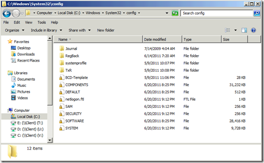
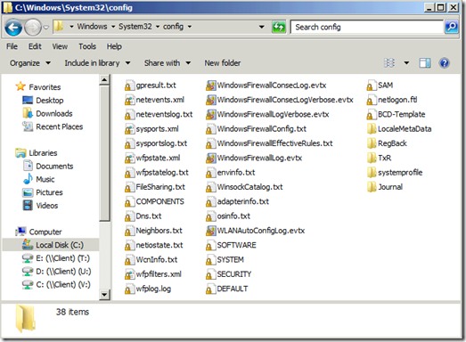
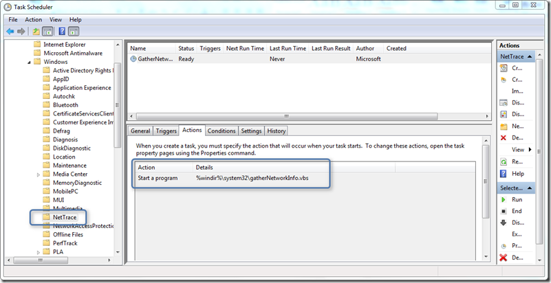

I recently read the whitepaper“[Using Windows Script Host and COM to Hack Windows](http://www.sans.org/reading_room/whitepapers/hackers/windows-script-host-hack-windows_33583)” that is mentioning the GatherNetworkinfo.vbs script I hadn’t paid attention to yet. The gathernetworkinfo.vbs script comes by default with every Windows 7 installation and is located within the C:\Windows\System32\ folder. 

  The script does collect various networking information about the Windows 7 system and its configuration and dumps the information into the C:\Windows\System32\Config folder. 

  On a system where the script hasn’t been executed yet the Config folder looks as following:

  

  Now open a command prompt with elevated rights and run cscript c:\windows\system32\gathernetworkinfo.vbs When the script has completed you will see that additional files have been added to the Config folder. 

  

  The structure of the script is quite easy to understand. Within the first part of the script all functions are defined, the second part defines the output file names and the last part actually calls the individual data collection functions including the output file parameter. 

  The script is also defined within a scheduled task called Nettrace which is not scheduled to run automatically. 

  

