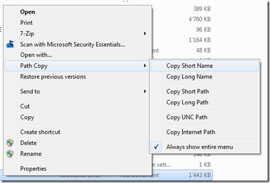

During my bi-weekly CodePlex browsing session, I came across this nice little utility called Path Copy Copy which is an Explorer add-in for copying file or folder paths. 

  

  Download Path Copy Copy from [here](http://pathcopycopy.codeplex.com/)

