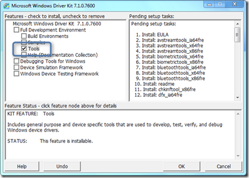

While reading the Microsoft Whitepaper [Diagnosing Application Compatibility Issues Affecting Windows Power Management](http://www.microsoft.com/download/en/details.aspx?id=26226) I came across a utility called PwrTest that can be used to diagnose sleep reliability issues and more… The below list shows the various options the tool provides. 

                       **Scenario**

                        **Description**

                                  sleep

                        for sleep/resume transition testing 

                                  battery

                        for battery information testing 

                                  info

                        for system capabilities information 

                                  es

                        for thread execution state changes 

                                  idle

                        for power idle statistics 

                                  ppm

                        for processor power management testing 

                                  timer

                        for system timer resolution statistics 

                                  disk

                        for disk idle statistics 

                                  device

                        for device idle statistics 

                                  monitor

                        for monitor dimming and blanking statistics 

                                  requests

                        for showing power requests 

                                  thermal

                        for ACPI thermal zone monitoring 

                                  processidle

                        for forcing idle/background tasks to be run 

                 PwrTest.exe is part of the Windows Driver Kit that can be downloaded from [here](http://www.microsoft.com/download/en/confirmation.aspx?id=11800). You will need to download an ISO file that is approx. 620 MB, but no worries, no need to install the Full Driver Kit to get this utility. When launching the installer, just select the Tools. 

  

  When accepting the default path, all tools will install under C:\WinDDK\7600.16385.1\Tools where you also find the Power Management folder that contains the PwrTest utility.

