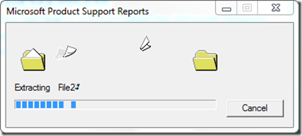
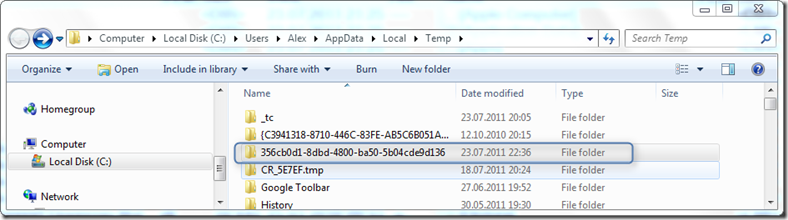
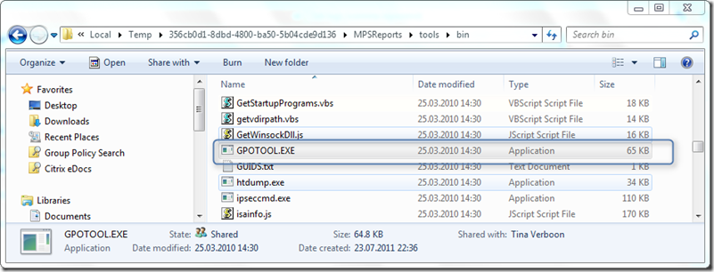

The latest version of the GPOtool is the one that is included within the Microsoft Windows 2003 Resource kit. That’s what we all used to know. BUT hey I just figured out a few days ago that there is actually an official newer version around it’s included within the [Microsoft Product Reports Utility](http://www.microsoft.com/download/en/details.aspx?id=24745).

  Here’s how to get it. When launching the mpsreports_x86.exe or mpsreports_x64.exe the utility extracts the files into the temp folder.

  

  when completed, head over to you temp folder and look for the folder with the most recent Modify time.

  

  Then navigate down to the bin folder folder located under C:\Users\Alex\AppData\Local\Temp\<your folder>\MPSReports\tools\bin and get the latest version of the GPOTool.exe

  

              **Source**        **File Version**                  Windows Server 2003 Resource Kit        6.0.4000.0                  Microsoft Product Support Reports Utility        6.0.5468.0          If you’re an Enterprise Admin dealing with GPOs I recommend downloading this latest version, it just happened to me that the newer version provided more details on a particular issue than the old one.

