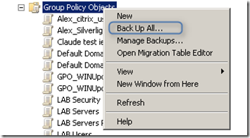
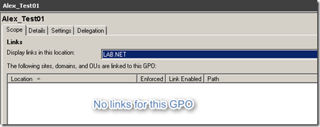
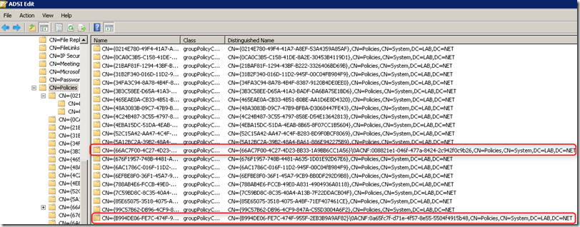

Group Policies are an essential part of every Windows Client infrastructure and it’s therefore critical to regularly spend some effort to ensure that things are in a healthy state. I would define a healthy Group Policy infrastructure as following:

	
- All Group Policies are correctly synched across all domain controllers
	
- There are no unlinked Group Policies (unless it’s by purpose because we use them only ad-hoc for testing purposes)
	
- There are no Group Policies that are completely disabled (unless it’s by purpose because we use them only ad-hoc for testing purposes)
	
- There are no orphaned Group Policies
	
- Group Policies do apply correctly on targeted clients.

There are a number of tools and scripts available that can help with the health assessment of your group policy infrastructure.

	
- Group Policy Management Console
	
- Group Policy Management Console Sample Scripts (download from [here](http://www.microsoft.com/download/en/details.aspx?displaylang=en&id=14536))
	
- GPOTOOL.exe Included in the Windows Server 2003 Resource Kit Tools, download from [here](http://www.microsoft.com/download/en/details.aspx?id=17657) or a newer version from [here](http://www.microsoft.com/download/en/details.aspx?id=24745) included within the Microsoft Product Support Reporting Tool).
	
- PowerShell Console

Before starting your GPO health assessment where most likely you end up deleting GPOs, I recommend that you create a backup of your current GPO state. You can create a backup by using the Group Policy Management Console or the PowerShell Backup-GPO cmdlet. When using the GPMC select the Group Policy Objects branch and select *Backup Up All* from the right context menu, you will then be asked to define the path where the backup will be saved and a description, then click Backup and wait for the process to complete.

When using PowerShell simply open a PowerShell command prompt and enter the below command. Note that you must create the target backup folder before running the command.

Backup-GPO –All – Path C:\Data\GPO_Backup

Wanna learn more about GPO backup’s? Read the Enable Backup and Restore for Group Policy article from Jeremy Moskowitz [here](http://www.scriptlogic.com/smbit/article/enable-backup-and-restore-for-group-policy) 

Another thing you want to consider doing is to create a report of all your current GPOs for example by running the following command within PowerShell

get-gporeport -All -ReportType HTML -Path c:\data\allgpo.html

OK, so now that we have created a Backup and a report  we’re ready to move on. Let’s first have a look whether all of our GPOs are being replicated nicely across all of our domain controllers. To do so, we are going to use the [GPOTool](http://www.microsoft.com/download/en/details.aspx?id=17657) from Microsoft

	
- checks the consistency of Group Policy Objects (GPOs) between the Sysvol- and Active Directory (AD)-based portions of GPOs
	
- checks GPO replication
	
- searches GPOs
	
- targets specific domain controllers (DCs) to allow testing of specific DC Group Policy status
	
- displays GPO information
	
- checks cross-domain GPOs

(Source of above list: [WindowsITPro Magazine](http://www.windowsitpro.com/article/resource-kit/q-what-s-gpotool-))

I recommend to redirect the GPOTool output into a text file so that you can analyze the results in notepad by simply running  the following command. GPOTool.exe >gposynch.txt

Or if you want to get more details use the verbose option.

command. GPOTool.exe /verbose >gposynch.txt

Once GPOTool has completed open the gposynch.txt file and you will see the results. If all is OK the Status for a given GPO will be reported as following:

============================================================
Policy {3B3C58EE-D65A-41A3-BADF-DA6BA75E1BD6}
Friendly name: VDI_Desktop_Personal
Policy OK
============================================================

Or when using verbose mode, the results look like this

============================================================
Policy {3B3C58EE-D65A-41A3-BADF-DA6BA75E1BD6}
Friendly name: VDI_Desktop_Personal
Policy OK
Details:
------------------------------------------------------------
DC: LAB-DC02.LAB.NET
Friendly name: VDI_Desktop_Personal
Created: 5/21/2011 2:18:47 PM
Changed: 6/25/2011 5:04:13 PM
DS version:     41(user) 45(machine)
Sysvol version: 41(user) 45(machine)
Flags: 0 (user side enabled; machine side enabled)
User extensions: [{00000000-0000-0000-0000-000000000000}{BEE07A6A-EC9F-4659-B8C9-0B1937907C83}][{B087BE9D-ED37-454F-AF9C-04291E351182}{BEE07A6A-EC9F-4659-B8C9-0B1937907C83}]
Machine extensions: [{00000000-0000-0000-0000-000000000000}{3BAE7E51-E3F4-41D0-853D-9BB9FD47605F}][{35378EAC-683F-11D2-A89A-00C04FBBCFA2}{D02B1F72-3407-48AE-BA88-E8213C6761F1}][{7150F9BF-48AD-4DA4-A49C-29EF4A8369BA}{3BAE7E51-E3F4-41D0-853D-9BB9FD47605F}][{827D319E-6EAC-11D2-A4EA-00C04F79F83A}{803E14A0-B4FB-11D0-A0D0-00A0C90F574B}][{C631DF4C-088F-4156-B058-4375F0853CD8}{D02B1F72-3407-48AE-BA88-E8213C6761F1}]
Functionality version: 2
------------------------------------------------------------
------------------------------------------------------------
DC: LAB-DC01.LAB.NET
Friendly name: VDI_Desktop_Personal
Created: 5/21/2011 2:18:47 PM
Changed: 6/25/2011 5:03:44 PM
DS version:     41(user) 45(machine)
Sysvol version: 41(user) 45(machine)
Flags: 0 (user side enabled; machine side enabled)
User extensions: [{00000000-0000-0000-0000-000000000000}{BEE07A6A-EC9F-4659-B8C9-0B1937907C83}][{B087BE9D-ED37-454F-AF9C-04291E351182}{BEE07A6A-EC9F-4659-B8C9-0B1937907C83}]
Machine extensions: [{00000000-0000-0000-0000-000000000000}{3BAE7E51-E3F4-41D0-853D-9BB9FD47605F}][{35378EAC-683F-11D2-A89A-00C04FBBCFA2}{D02B1F72-3407-48AE-BA88-E8213C6761F1}][{7150F9BF-48AD-4DA4-A49C-29EF4A8369BA}{3BAE7E51-E3F4-41D0-853D-9BB9FD47605F}][{827D319E-6EAC-11D2-A4EA-00C04F79F83A}{803E14A0-B4FB-11D0-A0D0-00A0C90F574B}][{C631DF4C-088F-4156-B058-4375F0853CD8}{D02B1F72-3407-48AE-BA88-E8213C6761F1}]
Functionality version: 2
------------------------------------------------------------

The GPOTool checks the Active Directory and the Sysvol part of each GPO, if DS version and Sysvol version are equal your GPO is being successfully synched across all Domain Controllers.

But you might also find results that look as following:

============================================================
Policy {66AC7F00-4C27-4D23-BB33-1A9BB6CC1A56}
Error: Property gPCFunctionalityVersion not found on LAB-DC02.LAB.NET
Error: Property displayName not found on LAB-DC02.LAB.NET
Error: Property versionNumber not found on LAB-DC02.LAB.NET
Error: Property gPCFileSysPath not found on LAB-DC02.LAB.NET
Error: Property flags not found on LAB-DC02.LAB.NET
Error: Version mismatch on LAB-DC02.LAB.NET, DS=not found, sysvol=1
Error: Functionality version on LAB-DC02.LAB.NET is not found, version 2 expected
Friendly name: not found
Error: Property gPCFunctionalityVersion not found on LAB-DC01.LAB.NET
Error: Property displayName not found on LAB-DC01.LAB.NET
Error: Property versionNumber not found on LAB-DC01.LAB.NET
Error: Property gPCFileSysPath not found on LAB-DC01.LAB.NET
Error: Property flags not found on LAB-DC01.LAB.NET
Error: Version mismatch on LAB-DC01.LAB.NET, DS=not found, sysvol=1
Error: Functionality version on LAB-DC01.LAB.NET is not found, version 2 expected
Details:
------------------------------------------------------------
DC: LAB-DC02.LAB.NET
Friendly name: not found
Created: 9/16/2008 11:51:39 AM
Changed: 4/17/2009 7:52:40 AM
DS version: not found
Sysvol version: 0(user) 1(machine)
Flags: not found
User extensions: not found
Machine extensions: not found
Functionality version: not found
------------------------------------------------------------
------------------------------------------------------------
DC: LAB-DC01.LAB.NET
Friendly name: not found
Created: 9/16/2008 11:51:39 AM
Changed: 4/21/2009 9:26:52 AM
DS version: not found
Sysvol version: 0(user) 1(machine)
Flags: not found
User extensions: not found
Machine extensions: not found
Functionality version: not found
------------------------------------------------------------
============================================================

Whenever you find errors, I recommend that you re-run the gpotool again after a few minutes, I have made the experience that sometimes the tools seems to report SYSVOL mismatches, but then a few minutes later it wouldn’t, I guess this is probably because replication was going on in the background when the tool was run.

Errors are usually related to GPOs not being in synch, the GPO is in Active Directory but there is no related folder within the SYSVOL directory or there is a GUID folder in the SYSVOL directory but no GPO object in AD anymore. The best is to carefully analyze each case if you come across orphaned GUID folders within the SYSVOL folder that have no corresponding object in AD, you can delete it (I suggest you make a copy before). When coming across a GPO object in AD that has no folder in SYSVOL it’s probably best to delete that one as well. You can delete them using the Group Policy Management Console or using the Remove-GPO PowerShell cmdlet. If the GPO has no Name defined you won’t see it in the Group Policy Management console, in that case delete the GPO using the GUID.

Remove-GPO –GUID <GUID OF GPO>

Good now that we got rid of some corrupt old GPOs let have a look at those that aren’t linked, and therefore in most cases aren’t needed anymore. Again you can either use the Group Policy Management Console or use the script FindUnlinkedGPOs.wsf that comes with the GPMC sample scripts.

again, using the GPMC is ok if you just have a few of them, if you have many GPOs I recommend running the FindUnlinkedGPOs.wsf script.

cscript C:\Program Files\Microsoft Group Policy\GPMC Sample Scripts\FindUnlinkedGPOs.wsf > unlinked.txt

Result

== GPOs that are not linked anywhere in LAB.NET ==

NOTE: links to sites, as well as external domains, will not be checked.

{34FA3C94-8A78-4B4F-8387-9120B4DE0EE0} - Alex_Test01
{48A3083B-09C7-47B9-BFBA-D3068447FE43} - Alex_citrix_users
{788AB4E6-FCCB-49E0-A831-4904936A0118} - Alex_Silverlight

Now whether you delete these GPOs is up to you, maybe they aren’t linked by purpose but are used only on an ad-hoc basis for testing purposes, if there are more GPO Admins within your enterprise you might want to ask them first before just deleting them.

Another script you want to run is the FindDisabledGPOs.wsf, this script lists those GPO’s where both the user and computer side of the GPO settings are disabled. Another annoyance are GPOs with the same name. If you have naming conventions for GPOs this shouldn’t happen, but anyway it’s worth checking for these as well. Run the script FindDuplicateNamedGPOs.wsf to find any GPOs with duplicate names.

Now here’s a case I want to share with you, the log file reported the following:

============================================================
Policy {66AC7F00-4C27-4D23-BB33-1A9BB6CC1A56}\0ACNF:008821e1-046f-477a-8424-2c942f0c9b26
Error: Cannot access \\LAB-DC01.LAB.NET\sysvol\LAB.NET\policies\{66AC7F00-4C27-4D23-BB33-1A9BB6CC1A56}\0ACNF:008821e1-046f-477a-8424-2c942f0c9b26, error 3
Error: Cannot access \\LAB-DC02.LAB.NET\sysvol\LAB.NET\policies\{66AC7F00-4C27-4D23-BB33-1A9BB6CC1A56}\0ACNF:008821e1-046f-477a-8424-2c942f0c9b26, error 3
Details:
------------------------------------------------------------
DC: LAB-DC01.LAB.NET
Friendly name: LAB-SAB-Wireless
Created: 9/16/2008 11:51:18 AM
Changed: 4/21/2009 9:26:52 AM
DS version:     0(user) 1(machine)
Sysvol version: not found
Flags: 0 (user side enabled; machine side enabled)
User extensions: not found
Machine extensions: [{0ACDD40C-75AC-47AB-BAA0-BF6DE7E7FE63}{2DA6AA7F-8C88-4194-A558-0D36E7FD3E64}]
Functionality version: 2
------------------------------------------------------------
------------------------------------------------------------
DC: LAB-DC02.LAB.NET
Friendly name: LAB-SAB-Wireless
Created: 9/16/2008 11:51:18 AM
Changed: 4/17/2009 7:52:40 AM
DS version:     0(user) 1(machine)
Sysvol version: not found
Flags: 0 (user side enabled; machine side enabled)
User extensions: not found
Machine extensions: [{0ACDD40C-75AC-47AB-BAA0-BF6DE7E7FE63}{2DA6AA7F-8C88-4194-A558-0D36E7FD3E64}]
Functionality version: 2
------------------------------------------------------------

What’s interesting here is that the Policy GUID is much longer than the other ones, in fact it looks like something went terribly wrong here. The GUID for this Policy looks like this

{66AC7F00-4C27-4D23-BB33-1A9BB6CC1A56}\0ACNF:008821e1-046f-477a-8424-2c942f0c9b26

whereas a usual policy looks as following

{5A12BC2A-39B2-48A4-BA61-886E942275B9}

Now most likely because this GPO has such a weird GUID, it isn’t shown in the Group Policy Management Console, and it can’t be deleted using the PowerShell Cmdlet because the command fails, most likely due to it’s weird GUID.

So what to do with a GPO object we can’t get rid of using the standard tools and procedures? We are going to use ADSI Edit.

IMPORTANT NOTE ! BE VERY CAREFULL WHEN USING ADSI EDIT, doing the wrong thing can cause severe damage to your Active Directory Infrastructure.

When opening ADSI Edit and navigating to the Policies branch, we see the two damaged GPO objects.

after deleting the GPOTool didn’t report the errors anymore.

