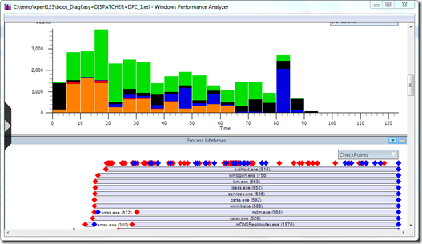

Those of you who have been using the Windows Performance Analysis Toolkit know of the many command line options xperf provides. Xperf123 solves that challenge by providing an intuitive user interface to configure and start a trace. 

  Xperf123 provides the following trace options:

     
- General Base    
- Disk I/O    
- High CPU    
- Paged/Non Paged Pool    
- Working Set    
- Heap Leaks    
- Virtual Allocations (Memory Leak)    
- Wait Analysis    
- Shutdown    
- Reboot    
- Startup    
- Hibernation 

  

  Note that the Xperf123 download package has the 64 bit version included of the following tools. XPerf.exe, perfctrl.dll, xbootmgr.exe,    
xbootmgrSleep.exe and xperf.exe. If you are running a 32 bit version of Windows 7 you must download the appropriate binaries from [here](http://www.microsoft.com/download/en/details.aspx?id=8279)

  Xperf123 can be downloaded from [here](http://xperf123.codeplex.com/)

