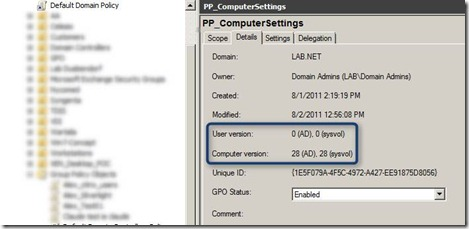

Ever wondered how the Group Policy versioning works? Below you find a number of articles and resources that provide a good insight how GPO versioning works. 

  

  Group Policy Team Blog – [Understanding the Domain based GPO version number](http://blogs.technet.com/b/grouppolicy/archive/2008/01/08/understanding-the-domain-based-gpo-version-number-scripts-included.aspx)

  TechNet - [Displaying Version Properties of a Group Policy Object](http://technet.microsoft.com/en-us/library/ff730972.aspx)

  MSDN - [Group Policy: Core Protocol Specification](http://msdn.microsoft.com/en-us/library/cc232478(v=prot.13).aspx) (Details in section 3.3.5)

