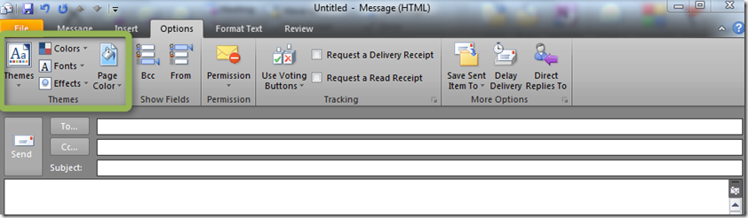
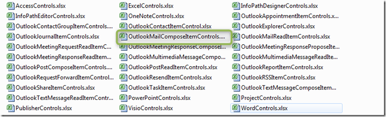
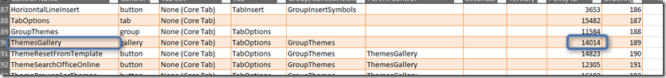
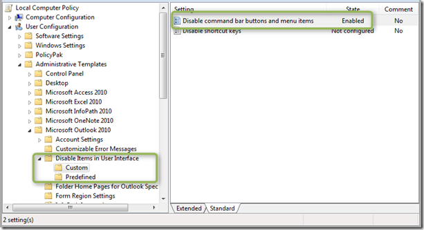
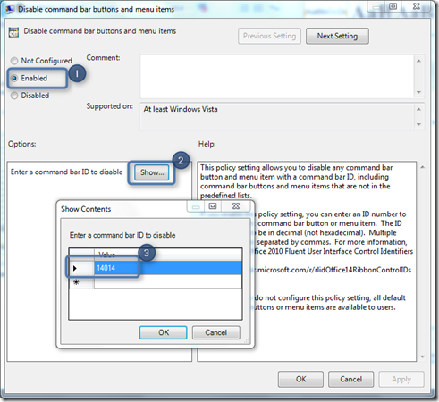
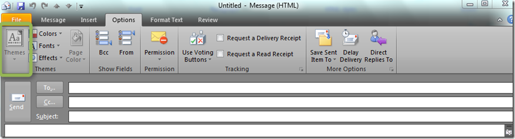

Today I am going to show you how to disable a Ribbon Item using Group Policy, Okay, what’s the deal you might think, simply find the item within the Office GPO settings and enable it. Right,almost, it’s just that Microsoft didn’t list all possible settings within the Office ADMX/ADML file, probably because there are too many of them. But there is a setting called “Disable command bar buttons and menu items” that you can enable and specify the Ribbon Policy ID. 

  Suppose we want to prevent users from selecting the Theme Option when creating a new e-mail because we don’t want them to send fancy e-mails with flowers in the background. 

  

  Before we can actually start enabling the “Disable command bar buttons and menu items” Group Policy Setting we need to know the Policy ID for that Ribbon item. These can be found in the [Office 2010 Help Files: Office Fluent User Interface Control Identifiers](http://www.microsoft.com/download/en/details.aspx?displaylang=en&id=6627). Once you have the executable downloaded and extracted the content you will see a whole bunch of Excel files. 

  

  Now Microsoft is going to make a scout of you, you will need to search a bit, in this case we are going to use the OutlookMailComposeItemControls file. and search for the Theme control IDs. 

  

  Once you have found the corresponding ID, open the Group Policy editor and open the “Disable command bar buttons" and menu items” setting. 

   

  

  Once you have added the ID, click OK and apply the setting. Open a command prompt and run gpupdate to get the settings applied and then open Microsoft Outlook 2010 and create a new mail. As you can see in the screenshot below, the Themes options is now disabled. 

  

  That’s it.

