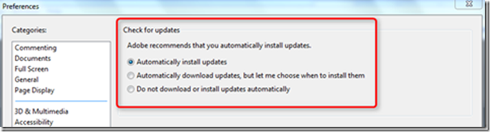
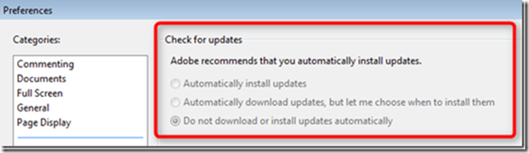
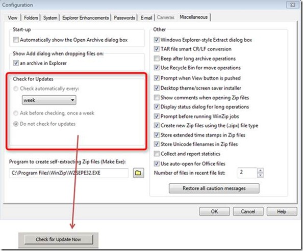
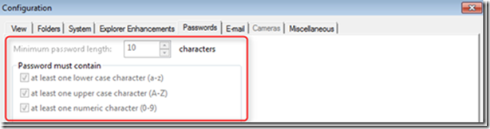

Group Policy is a fundamental part of a managed Windows infrastructure. Using Group Policy Objects (GPO) allows IT administrators to configure and lock down clients and servers providing a standardized and secure environment. But despite the fact that Group Policy technology is around since the introduction of Windows 2000 its use seems to be limited to the Windows operating system and Microsoft Application product suite. Unfortunately not many 3rd party software vendors provide built-in Group Policy based configuration support for their applications.         If an application doesn’t provide native Group Policy support, the only possibility for IT administrators to configure and deliver application configuration settings is either by creating a custom ADM/ADMX template or use Group Policy Preferences.         Here are the main problems with ADM/ADMX solutions:
- Only works for Registry based application settings, but unfortunately some applications store their configuration data in other places and formats.
- Users can still change settings through the application’s UI (that is, no “true lockdown”)
- When using an ADM/ADMX template we’re not really creating a Group Policy. We’re using Group Policy as the way to deliver the setting, but the actual setting is what’s called a “Preference”. These remain within the registry when the policy is removed.
- Group Policy Preferences (Registry items) overcome some of the shortages of native Group Policy settings, but still doesn’t allow disabling or completely hiding application settings. The big problem with Group Policy Preferences’ Registry items is that you need to know every single item you want to configure and every possible value for that setting. It’s really not possible to use Group Policy Preferences Registry items if you want to deliver more than a dozen settings to an application.

    You can find an example of a custom ADM file for Adobe Reader [here](http://www.appdeploy.com/articles/acro5disableupdatecheck.pdf). If you look at that example you will notice that I wrote this for Adobe Reader 5 and that it was nearly 10 years ago that I published this, but you know what, things haven’t changed that much. In fact the only major changes that we have seen in Group Policy land since Windows 2000 is that with each new release of the Windows operating system and Office Suite the number of configurable policy settings has increased. Another big improvement was the introduction of Group Policy Preferences with Server 2008.    Okay, let’s do a short recap; we actually use Group Policy because we want to deploy a seamless configuration across our managed clients.
- Look and Feel
- Security Settings
- System / Application behavior
- Reduce user down-time due to misconfigured OS and application settings
- Client lock down

    As mentioned previously there is a wealth of configuration settings for the Windows operating system and most Microsoft applications, but when it comes to 3rd party applications like Adobe Reader, WinZip, Firefox, Java, Flash or other line of business applications companies use the possibilities of configuring or locking down an application are limited.         Adobe Reader, Adobe Flash, Java…. Hey aren’t these exactly those applications we see running on almost every SMB and Enterprise client and wouldn’t we want to take control over these applications as well?         **PolicyPak** is a solution from Group Policy MVP Jeremy Moskowitz which can help you gain control over applications installed on your user’s windows clients. Let’s have a look at the automatic updates feature in Adobe Reader and WinZip.         As you can see from the screen shots below, both the Adobe Reader and WinZip allow configuring automatic updates. For most companies we would want to disable this setting, as we don’t want users just installing newer versions (Remember about the standardized environment).                  [
![clip_image002[1]](images/clip_image0021_thumb.png)
](images/clip_image0021.png)         Now of course we can go under the hood and find the appropriate registry key do disable automatic updates and deploy that via GPO or GPP, but that won’t stop the user from changing the setting manually.         With PolicyPak we can not only change the default setting, but can also prevent the user from making any changes. The screenshots below show a PolicyPak configured client where we have configured both Adobe Reader and WinZip not to look for updates, in addition we have disabled the settings so that users cannot change things here.                           Also note that we have completely removed the button “Check for Update now” from the UI.         As you can see, PolicyPak has some “magic” that ADM/ADMX simply doesn’t: It can literally remove user interface elements so users cannot change your desired configuration.         Now let’s have a look at another configuration item. To increase security we want our users to use strong passwords for the ZIP archives. By using ADM/ADMX or Preferences we can pre-define the password settings we would like users to use, but we cannot enforce them.         [
![clip_image006[1]](images/clip_image0061_thumb.png)
](images/clip_image0061.png)         With PolicyPak we can actually preconfigure the settings, and also enforce them by disallowing users to make any changes to the settings.                  And finally, there might be situations where we simply do not want a user to access a certain feature like the Cameras option in WinZip. Using PolicyPak we can completely remove access to the Camera settings.         [
![clip_image008[1]](images/clip_image0081_thumb.png)
](images/clip_image0081.png)         As you can see PolicyPak can help you taking Group Policy Management beyond what’s in the box. In [Part2](https://www.verboon.info/index.php/2011/08/taking-group-policy-beyond-whats-in-the-box-part2/) I will demonstrate how easy it is to get PolicyPak setup and running. More Information about **PolicyPak** can be found [here](http://www.GPanswers.com/1.html?w=PP&p=cpqalve)

