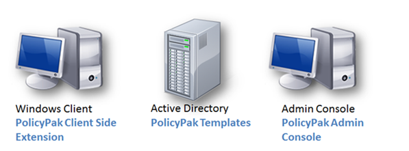
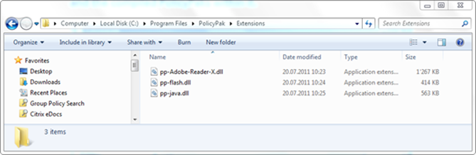
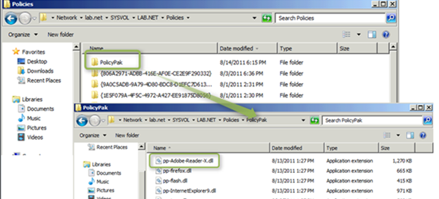
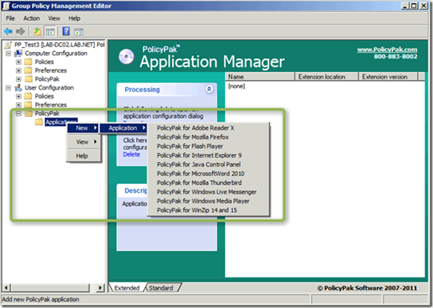
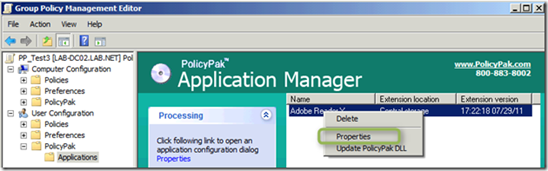
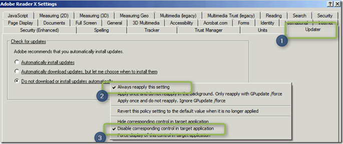
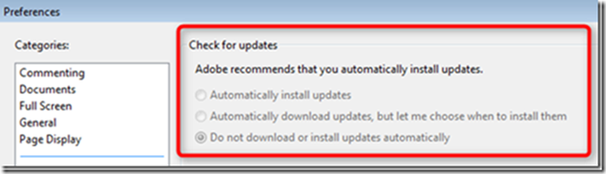

In my [previous post](https://www.verboon.info/index.php/2011/08/taking-group-policy-beyond-whats-in-the-box-part1/) I provided a brief overview of how PolicyPak can take you beyond default Group Policy management. In today’s post I am going to show you how easy it is to get PolicyPak up and running in your test environment. 

  You can test PolicyPak on a local computer or within an Active Directory environment. 

  Now beside the awesome things PolicyPak can do, what I really like about this solution is that it just sits on top of what you already have, there is no need for any additional infrastructure to get PolicyPak going. 

  The following picture shows the test environment we will use for setting up PolicyPak in just a few simple steps. 

  

  **Preparation**

  To try out PolicyPak you only need the following:

     
- A Windows XP or higher (Vista, Windows 7, etc) client where you will install the PolicyPak CSE. PolicyPak will pretend to act as if it’s fully licensed when the client has the word “computer” in its name. This makes it easy to perform 100% of the tests right away. If the computer has any other name, PolicyPak works in Community Edition mode where only the fist PolicyPak detected is processed and only applies the first 25 registry elements.     
- A Windows XP or higher (Vista, Windows 7, Windows Server 2008, etc.) Group Policy Management Console is also required. Here you will install the PolicyPak Management Console    
- Both computers are member of the Active Directory (if you don’t have an active directory you can simply perform al steps mentioned below on the same client).  

  **Step 1 – Preparing the Windows Client**

  First you must install the PolicyPak client side extension on each client that you want to control using PolicyPak. PolicyPak runs on Windows XP or higher (Windows Vista, Windows 7 clients and 2003, 2008 and 2008-R2 servers.) Depending on whether you are running a 32 or 64 Bit OS you must install PolicyPak CSE Setup x32.msi or PolicyPak CSE Setup x64.msi. There are no options to choose during the installation, so just install and reboot the client when the installation is finished. 

  If you’d like to follow along with an example, I will be using Adobe Reader to show off PolicyPak in my tests. So, feel free to install Adobe Reader X also. 

  **Step 2 – Preparing the Management Console**

  The PolicyPak management console isn’t a separate console. It simply integrates nicely into the existing Group Policy Management console. Depending on whether your management station is running a 32 or 64 OS install the PolicyPak Admin Console x32.msi or PolicyPak Admin Console x64.msi. Again there are no special options to choose from during installation so just follow the installation steps. 

  **Step 3 – Install the Pre-configured PolicyPaks**

  A number of pre-configured PolicyPaks are provided with the PolicyPak software. At the time of writing this blog post FREE (included) pre-configured PolicyPaks are available for the following applications: Firefox, Acrobat Reader, Java, WinZip, Thunderbird, App-V Client, Flash Player, Foxit Reader, IE9, Media Player, Live Messenger, Yahoo Messenger, Office 2010, Autocad 2012 and Snagit. The PolicyPak “pak” for each application is stored in a DLL called pp-*Applicationname*.dll. (Note that all PolicyPak extension DLL file names must start with pp-). In this example we will be using the PolicyPak for Adobe Rader X where the extension DLL is called pp-Adobe-Reader-X

  You can install the pre-configured (and self created) PolicyPak extension DLLs either locally on the management station or within the Central Store. For testing purposes storing the PolicyPaks locally on the management station isn’t an issue, but when using PolicyPak in production you should consider storing the PolicyPaks within the central store, as this prevents conflicts when using multiple management stations. 

  When storing the PolicyPak extension DLL locally you must copy them to the following location: C:\Program Files\PolicyPak\Extensions.

  

  If you decide to store them within the central store you must first create a folder called PolicyPak within the central store and then copy the extension DLL into that folder. 

  

  **Step 4 – Create a PolicyPak enabled GPO**

  In this step, we will create the first PolicyPak enabled Group Policy Object. Launch the Group Policy Management console and create a new GPO. Then open the PolicyPak branch and select New – Application – PolicyPak for Adobe Reader X. 

  

  When the PolicyPak is added, select Properties to open the PolicyPak configuration panel. 

  

  The Adobe PolicyPak configuration settings panel opens and you will notice that the UI almost looks identical to the one within the Adobe Reader application. Select the Updater (1) Tab and select “Do not download or install updates….” then select the right context menu and select “Always reapply this setting” (2) and “Disable corresponding control in target application” (3). Then click OK to confirm the setting. 

  

  **Step 5 – See the PolicyPak in Action**

  Finally logon with a test user account that will get the new created GPO applied. If all goes well, just fire up Acrobat Reader X on your client computer, and you’ll immediately see PolicyPak at work.

  

  In Part 3 I will show you how easy it is to create your own PolicyPak using the PolicyPak design studio.

