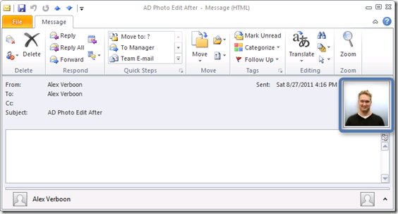
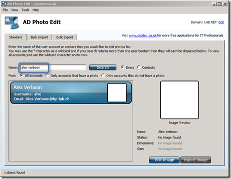
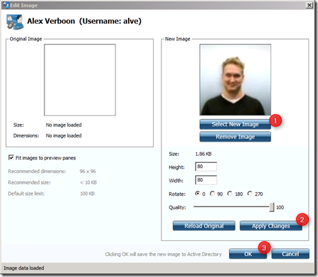
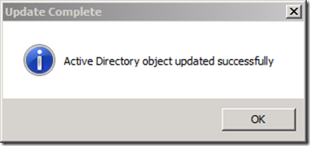
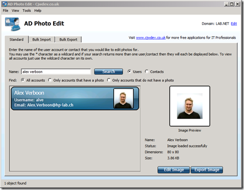
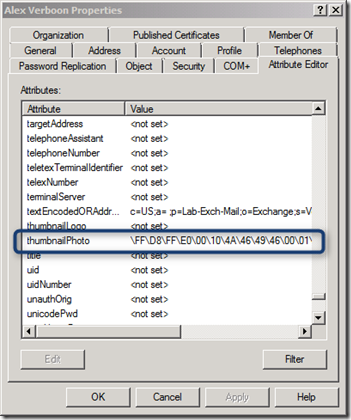

Last night I came across this FREE utility called AD Photo Edit developed by [Chris Wright](http://cjwdev.wordpress.com/about-me/)  which allows you to upload your picture into Active Directory. The result of doing that is that people who use Outlook 2010 can see your profile picture in the mail you send them. 

  

  Using AD Photo Edit is simple, just [download](http://www.cjwdev.co.uk/Software/ADPhotoEdit/Info.html) and install the utility and launch it. Then enter your name and click the Search button. If AD Photo Edit finds your user object in Active Directory it will show your current Picture which is probably empty unless a picture was already uploaded.

  

  Click on the Edit Image button. 

  

  Select a new Image, then Apply Changes and OK to save the picture in Active Directory. If all goes fine you should get the following message. 

  

  and your picture is now loaded in Active Directory. 

  

  Note that your Active Directory forest schema must be 2008, if you’re not sure if this is already the case open the Active Directory Users and Computers console, ensure that Advanced Features is enabled in the View menu and open your user object, then select the Attribute Editor tab and search for the **thumbnailPhoto** Attribute. 

  

  **More Information**    
[GAL Photos: Frequently Asked Questions](http://blogs.technet.com/b/exchange/archive/2010/06/01/3410006.aspx)    
[The thumbnailPhoto Active Directory Attribute Explained](http://cjwdev.wordpress.com/2010/11/03/the-thumbnailphoto-attribute-explained/)

