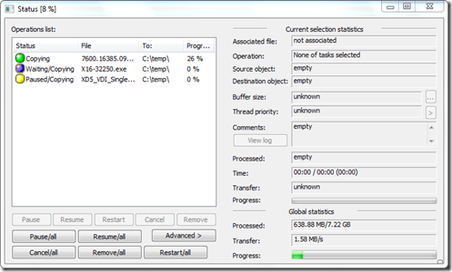

You probably know that problem, you’ve started copying a bunch of files or folders from A to B and BANG at some stage you get an error or maybe you just have to move to another place and don’t have network connectivity for a short while. Copy Handler can help here.

  

  Although Copy Handler also supports “moving” data, I do personally actually never move data, but rather first copy and then delete. Well possible that I am a bit conservative here, but I rather know something got copied properly before deleting something, if a move operation fails you might find yourself in an unpleasant situation.

  Copy Handler provides the following features:

- allow full-control over the copying or moving process by pause, resume, restart and cancel features;
- copying files faster than standard MS Windows copying (when copying data from one partition to another on the same physical hard disk);
- program is fully customizable - over 60 detailed options - from setting language (multiple languages) through auto-resume on error, shutting down system after copying finished to very detailed and technical (customizing copy/move thread - buffer sizes, thread priority, ...) ending on sounds on specific events;
- multiple languages support - and more may appear, since the translation process is quite easy;
- provides detailed information about copy/move process (current file, buffer sizes, priority, progress by size and visual bar, status, current and average speed, time elapsed/left, ...);
- can automatically resume all unfinished operations when system starts;
- limiting count of simultaneously processing tasks (copying/moving) - tasks are set into a queue and are processed in order it was inserted into queue;
- integration with system - adds additional commands to context menus of folders and drag&drop menus;
- this program is open source - just download and use...

  Copy Handler is FREE and can be downloaded from [here](http://www.copyhandler.com/en)

