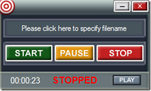

If you’re looking for a FREE and easy to use Screen Recorder then I suggest you head over to this [TechNet Magazine March 2009 Utility Spotlight article](http://technet.microsoft.com/en-us/magazine/2009.03.utilityspotlight2.aspx?pr=blog). There you will find a description and download link for this little nice tool. If you’re using Windows 7, which I assume most of you do by now, read the note that the end of the article.

  

