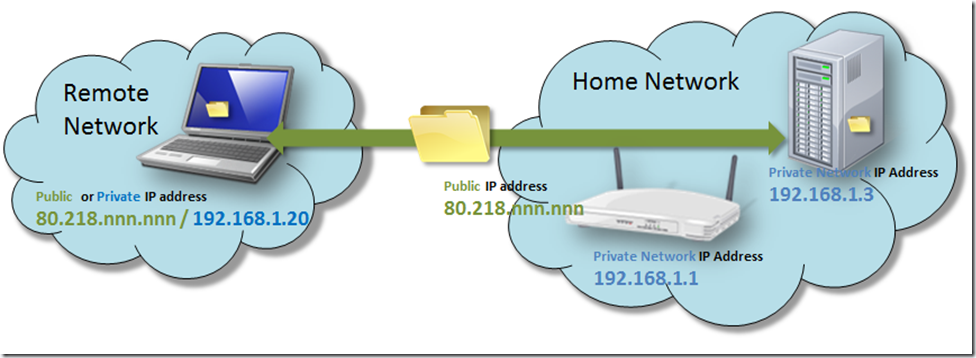
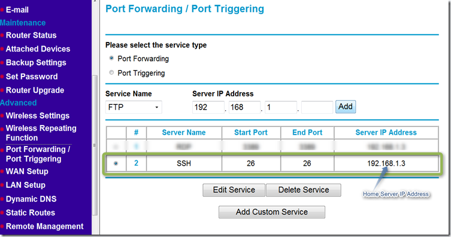
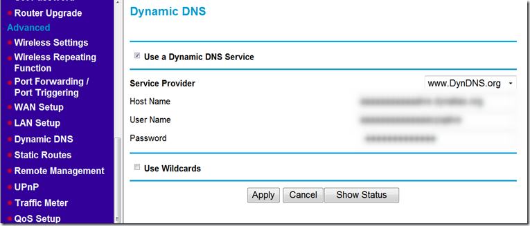
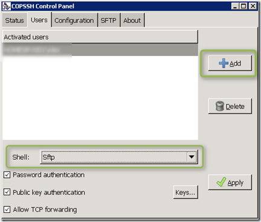
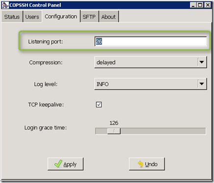
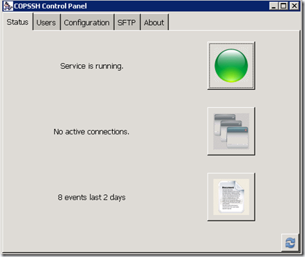
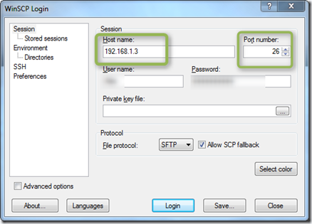
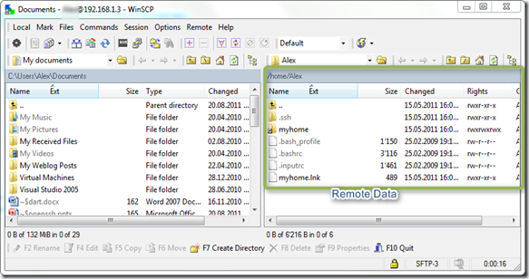
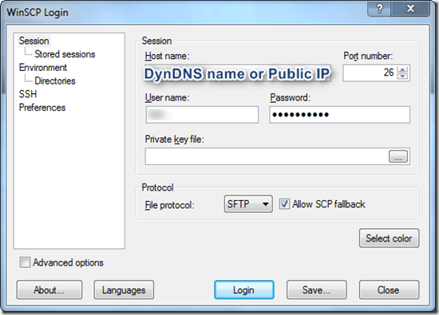

Today I want to show you one of the many possibilities to access your data remotely that you have stored on your home PC or Server using [OpenSSH](http://en.wikipedia.org/wiki/Secure_Shell). Before going into the details let’s have a short look at my setup. 

  

  The Remote Network is can be at a friends place, in the office or a public hotspot where my notebook has either a public or private network IP address. Within the Home network we have an internet router that has a public and internal IP Address, the Home Server also has an internal IP address. So here’s what we need to get this up and running: 

     
- Internet Access and a router where you can configure port forwarding /unless your system already has a public internet address).     
- [copssh](http://www.itefix.no/i2/copssh) a FREE OpenSSH Server     
- [WinSCP](http://winscp.net/eng/download.php) free open source SFTP, SCP, FTPS and FTP client.  

  
## Configuring the Router to allow SSH access

  Unless your Home Server already has a public IP address you will need to configure your internet router so that SSH traffic gets forwarded to your home server. On my Netgear Wireless Router I have configured the following. 

  

  
## Public IP Address or DNS name

  You will also need to know [your Public IP Address](http://whatismyipaddress.com/) that your router receives from the ISP, but unless you have a static one, that IP address can periodically change, so you want to consider using a [Dynamic DNS Service](http://dyn.com/dns/dyndns-free/). Most modern wireless routers allow configuring this directly within the wireless router configuration menu. 

  

  
## Installing and configuring OpenSSH Server

  The copSSH OpenSSH Server is installed on the Windows Home Server or Windows Client that is located within the Home network. Installation of copssh OpenSSH Server for Windows is simple. [Download](http://sourceforge.net/projects/sereds/files/Copssh/4.1.0/) the Installation package and then run the Copssh_x.x.x_Installer.exe, once installation is completed start the copSSH Control Panel. Select the Users Tab and add a user, then select SFTP as the Shell. 

  

  Then select the Configuration tab and configure the Port. Note that I changed the default SSH port from 22 to 26. The port must be the same as the one you defined in the Port Forwarding configuration on the router. 

  

  Then go back to the Status Tab and ensure that the OpenSSH Server is running. 

  

  
## Access the Data using WinSCP

  Install WinSCP and when completed launch it. Then let’s first test if things work “inside” the home network. Specify the **“Private IP Address**” of the system where you have installed the OpenSSH server, the Port, username and password and then select Login. 

  

  Confirm the messages you get when connecting to the remote system for the first time and let the client logon. If all worked fine, you will see the remote data directory structure. 

  

  Finally if you want to access your data remotely, you just need to enter the **Public IP Address** or **Dynamic DNS name.**

  

  A special Thanks to Claude for the inspiration of using SSH. 

  Enjoy.

