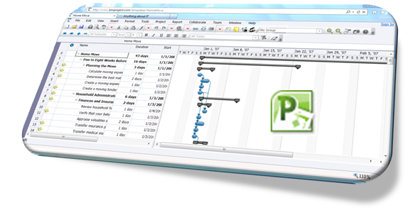

Today I received a project plan with the request to review it. Since I haven’t installed MS project yet on my new notebook that I just got last week, I replied that I would look at it as soon as I have installed MS Project. I thought I had a good excuse…… well it just took a few minutes until another colleague pointed me to AmiProject, an online viewer for MS Project files. 

  AmiProject supports MS Project 2002, 2003, 2007 and 2010 formats and runs in IE7+, Firefox, Chrome, Safari and Opera browsers. 

  

  Just go to [http://www.amiproject.com/app.aspx](http://www.amiproject.com/app.aspx) and open the project file. 

  Other free Project Viewers

  LiveProject – [Free Project Viewer](http://www.kadonk.com/products/project-viewers/free-project-viewer)

  Housatonic – [Free Online Viewer](http://www.projectviewercentral.com/projectviewer/projectviewerfree.html)

  MOOS – [Project Viewer Light](http://www.free-project-viewer.com/)

  Happy planning

