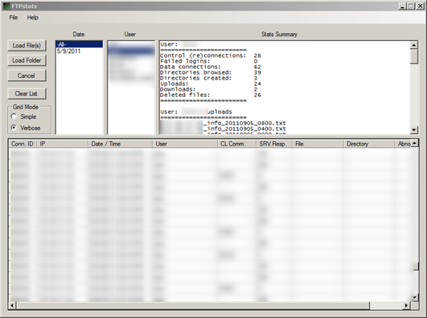

FTPstats is a log analyzer and stats compiler for FileZilla FTP Server. It generates usage statistics from log files and presents them in a user-friendly fashion.

  

  FTPStats can be downloaded from [here](http://sourceforge.net/projects/ftpstats/)

