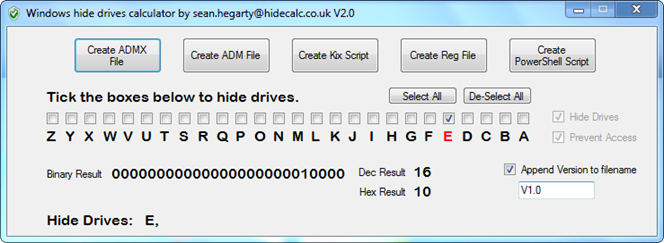
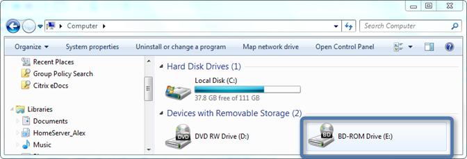
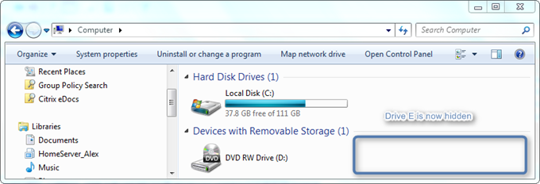
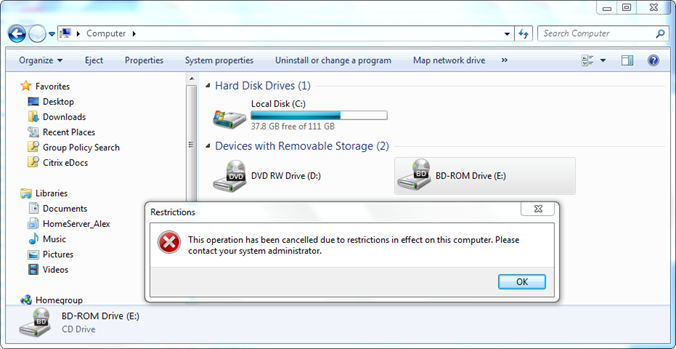

Want to make a drive disappear in Windows or prevent users from accessing it? then here’s the tool you need. **HIDECALC** allows you to define the drives to hide or prevent access to. HIDECALC does not apply the change on the system itself, but provides various options for exporting the settings into the following formats:

     
- Group Policy ADMX or ADM format    
- Registry File    
- Kix Script    
- PowerShell Script 

  

  So here’s how this works. 

     
- Launch HIDECALC,     
- Define the drives to hide or prevent access to    
- Apply the script / GPO 

  **Before**

  

  **After hiding the Drive**

  

  **After just preventing access to the Drive**

  

  HIDECALC is **FREE** and can be downloaded from [here](http://www.hidecalc.co.uk/)

