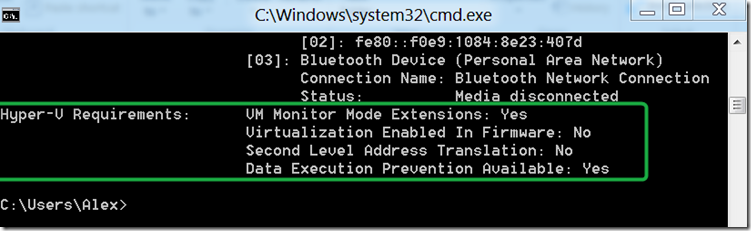

Many articles refer to the Sysinternals [Coreinfo](http://technet.microsoft.com/en-us/sysinternals/cc835722) utility to check whether your system can run Hyper-V on Windows 8 or not. But just this morning I found out that the **systeminfo** command that is included in Windows provides some additional Hyper-V related information. 

  

  More Information about Hyper-V on Windows 8   
[Bringing Hyper-V to “Windows 8”](http://blogs.msdn.com/b/b8/archive/2011/09/07/bringing-hyper-v-to-windows-8.aspx)     
[How to Check if Your CPU Supports Second Level Address Translation (SLAT)](http://www.howtogeek.com/73318/how-to-check-if-your-cpu-supports-second-level-address-translation-slat/)

