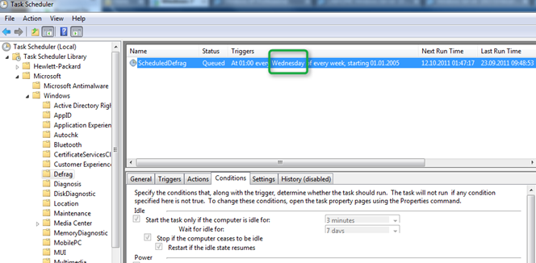
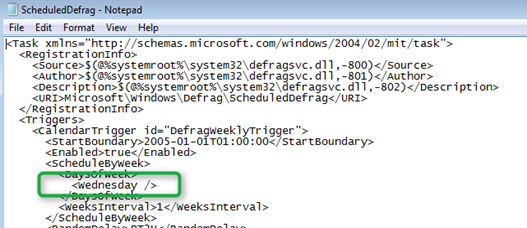
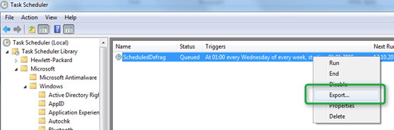
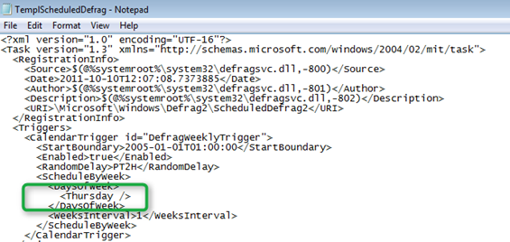
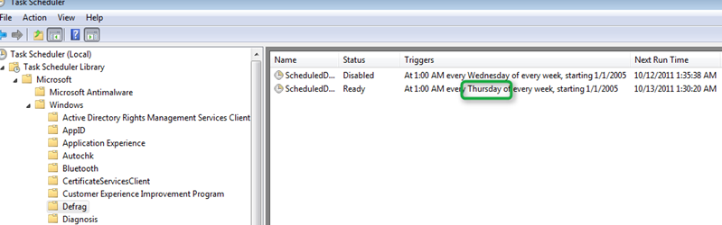

As you probably know Windows 7 has a build-in scheduled task to run Defrag every Wednesday every week. One of my clients asked me to have the day changed from Wednesday to Thursday. Well,  hat I thought would be done in a few minutes ended up in a little journey, but finally I got it to work. As you can see from the below screenshot, by default Defrag is started every Wednesday every week. 

  

  Windows 7 has a build-in command line tool called **schtasks.exe** that allows you to create, change, delete scheduled tasks from the command line, but unfortunately the /Change option doesn’t allow you to change the **Day** of when a task should run. As you might know the Windows build-in Task configuration is stored under C:\Windows\System32\Tasks\ the Defrag Task configuration file is stored under Microsoft\Windows\Defrag\ScheduledDefrag and when opening that file you will see that the day is specified in there as well and that the file content is in XML format. 

  

  So to change the scheduled task for defrag we are going to disable the default one and create a new one using a task template. First open the Task Scheduler, select the Defrag task and Export the Task. 

  

  Then open the exported XML file and change the DaysOfWeek value, in this case to Thursday.

  

  Then run the following command to disable the existing Task that runs every Wednesday

  schtasks.exe /change /TN "\Microsoft\Windows\Defrag\ScheduledDefrag" /Disable

  and this command to create the new one that will run every Thursday

  schtasks.exe /create /RU SYSTEM /TN "\Microsoft\Windows\Defrag\ScheduledDefrag2" /XML TemplScheduledDefrag.xml

  If all goes well you should get the following results

  SUCCESS: The parameters of scheduled task "\Microsoft\Windows\Defrag\ScheduledDefrag" have been changed.

  SUCCESS: The scheduled task "\Microsoft\Windows\Defrag\ScheduledDefrag2" has successfully been created.

  Then open or Refresh Task Scheduler and you’ll see the disabled and new scheduled Task for Defrag. 

  

